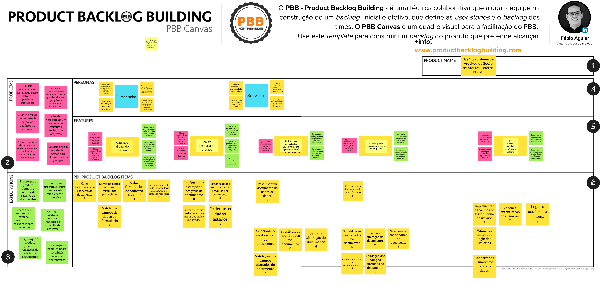

# Product Backlog Building(PBB)

Documento que resume o que foi tratado nas reuniões de realização do Product Backlog Building

## Histórico de Revisão
| Data | Versão | Descrição | Autor(es)|
|:----:|:------:|:---------:|:--------:|
| 22/08/21 | 0.9 | Adição do PBB | [Ivan Diniz Dobbin](https://github.com/darmsDD) |
| 23/08/21 | 1.0 | Acrescenta o histórico de revisão | [Ivan Diniz Dobbin](https://github.com/darmsDD) |
| 06/09/21 | 1.1 | Acrescenta as referências e atualização do PBB | [Ivan Diniz Dobbin](https://github.com/darmsDD) |

## Parte 1

**O que foi abordado**: 

- Foi iniciado o workshop do Product Backlog Building ministrado por Paulo Vitor Rocha.
- Realizadas as atividades desde problems até features

**Dificuldades**: Nenhuma

**Data** : 17/08/2021 das 18:00 até às 20:30

**Dúvidas da reunião**: Nenhuma

**Meio de comunicação**: Discord

**Tabela de Participação**:

|Membros|Participou|Justificativa para falta|
|:------:| :--------: | :--------: | 
|João Gabriel Rossi de Borba | :white_check_mark: | |
|João Matheus de Sousa Rodrigues | :white_check_mark: | |
|Paulo Vítor Coelho da Rocha | :white_check_mark: | |
|Ivan Diniz Dobbin | :white_check_mark: |  |
|Lorenzo de Lima Alves dos Santos | :white_check_mark:| |
|Gabriel Marcolino Rodrigues | :white_check_mark: | |
|Carlos Eduardo Miranda Roriz | :x: | Avisou após a reunião que um amigo estava indo estudar na Hungria |

## Parte 2

**O que foi abordado**: 

- Continuado o workshop do Product Backlog Building ministrado por Paulo Vitor Rocha.
- Realizadas a atividade de Product Backlog Items

**Dificuldades**: Nenhuma

**Data** :  20/08/2021 das 17:20 até às 19:00

**Dúvidas da reunião**: Nenhuma

**Meio de comunicação**: Discord

**Tabela de Participação**:

|Membros|Participou|Justificativa para falta|
|:------:| :--------: | :--------: | 
|João Gabriel Rossi de Borba | :white_check_mark: | |
|João Matheus de Sousa Rodrigues | :white_check_mark: | |
|Paulo Vítor Coelho da Rocha | :white_check_mark: | |
|Ivan Diniz Dobbin | :white_check_mark: |  |
|Lorenzo de Lima Alves dos Santos | :white_check_mark:| |
|Gabriel Marcolino Rodrigues | :white_check_mark: | |
|Carlos Eduardo Miranda Roriz | :x: | Nenhuma |

## Mudanças
Quando fomos realizar as histórias de usuário e após a reunião com o cliente, percebemos que não
havia tarefas para uma criação de campos. Assim atualizamos o PBB.
## Resultado Final

## Referências
Aguiar, Fábio; Caroli, Paulo. Product Backlog Building: Um guia prático para criação e refinamento de backlog pra produtos de sucesso. 1ª Edição. Rio de Janeiro: Editora Caroli, 2021.