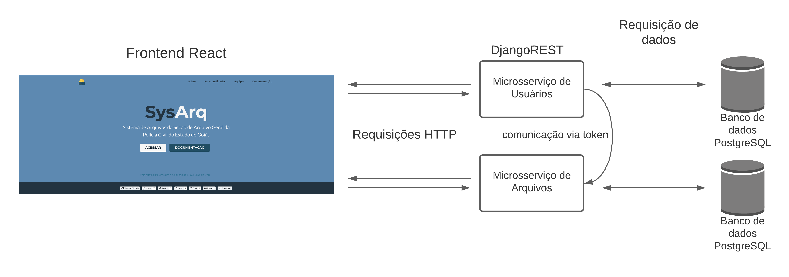
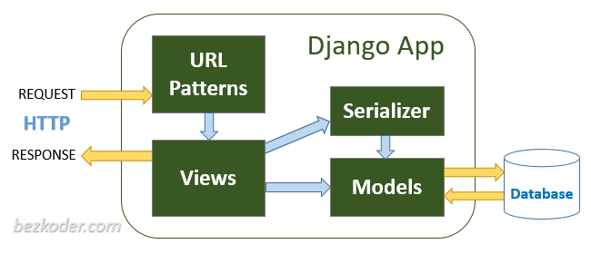
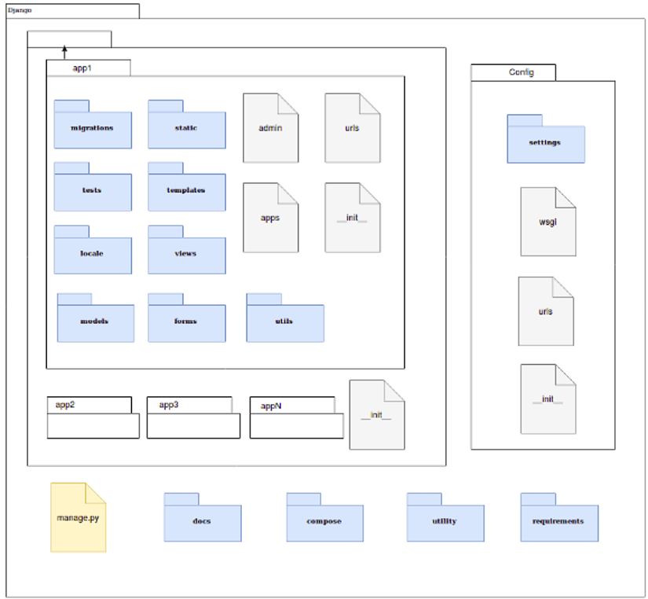
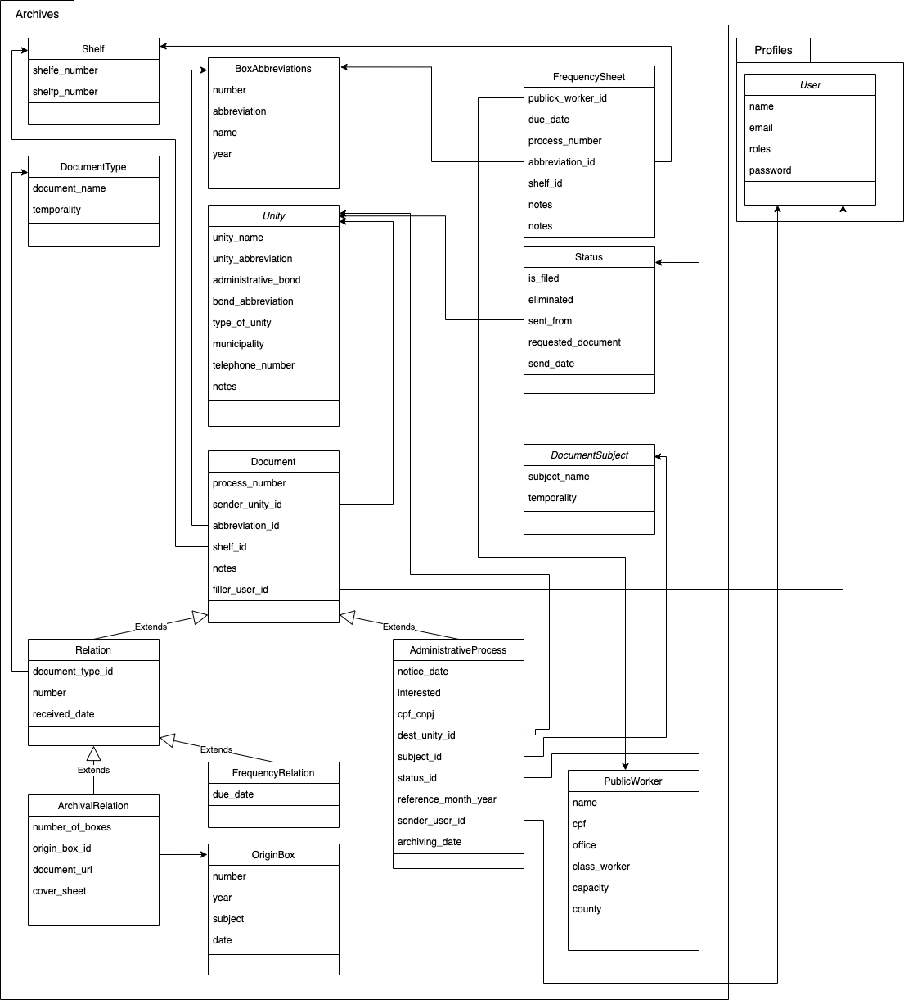

## **Documento de Arquitetura de Software**

**Histórico de Revisão**

|Data|Versão|Descrição|Autor|
| - | - | - | - |
|02/08/2021|0.1|Versão inicial|[Paulo Vitor](https://github.com/PauloVitorRocha)|
|09/09/2021|0.2|Adiciona diagrama de relações|[Paulo Vitor](https://github.com/PauloVitorRocha)|
|09/09/2021|0.3|Adiciona diagrama de classes versão inicial|[Paulo Vitor](https://github.com/PauloVitorRocha) e [João Matheus](https://github.com/J-Matheus)|
|10/09/2021|0.4|Alterando diagrama de classes|[Paulo Vitor](https://github.com/PauloVitorRocha) e [João Matheus](https://github.com/J-Matheus)|

## **1. Introdução**

### **1.1 Finalidade**
Este documento tem como objetivo apresentar uma visão geral abrangente da arquitetura de software do sistema SysArq e especificar decisões arquiteturais pertinentes ao desenvolvimento do Sistema de Arquivos da Polícia Civil do Estado de Goiás.

### **1.2 Escopo**
O SysArq é uma plataforma Web projetada para auxiliar na organização e no armazenamento de arquivos referentes ao Arquivo Geral da PC-GO. Os desenvolvedores são responsáveis por seguir este documento visando garantir o padrão proposto para a arquitetura.

### **1.3 Definições, Acrônimos e Abreviações**

|Abreviação|Definição|
| - | - |
|PC-GO|Polícia Civil do Estado de Goiás|

### **1.4 Visão Geral**
Este documento contém os detalhes sobre as características arquiteturais escolhidas pela equipe de desenvolvimento para a solução em software do projeto SysArq. Nele estão contidos os seguintes pontos, respectivamente: Representação da Arquitetura, Metas e restrições de Arquitetura, Visão dos casos de uso, Visão lógica e Visão de implementação.

## **2- Representação da Arquitetura**
A arquitetura utilizada no projeto será baseada em microsserviços. Microsserviço é uma abordagem para desenvolver uma única aplicação como um conjunto de serviços, cada um rodando em seu próprio processo e se comunicando através de mecanismos leves, geralmente através de uma API HTTP. Estes serviços são publicados em produção de maneira independente através de processos de deploys automatizados.

### **2.1 Diagrama de Relações**

## **3. Metas e Restrições de Arquitetura**

|**Restrição**|**Ferramenta**|
| :- | :- |
|Linguagem|Python|
|Framework|Django REST|
|Plataforma|Web|
|Segurança|O sistema permitirá acesso à documentos possivelmente sigilosos por isso os cadastros dos usuários serão realizados manualmente|
|Idioma|Português|

## **4. Visão Lógica**

### **4.1 Visão geral: Pacotes e Camadas**
A aplicação SysArq é construída sobre a biblioteca React no front-end e sobre o Django REST Framework no back-end. O React é uma biblioteca responsável apenas pela parte da "view" apesar de que com a adição de alguns outros componentes podemos encaixá-lo em uma arquitetura MVC. O framework Django utiliza uma variação da arquitetura MVC, chamada MTV(Model Template View) onde a “view” delega a informação apresentada para o template. O desenvolvimento em camadas e componentes é benéfico pois tem custos reduzidos de desenvolvimento e manutenção e também é de fácil reutilização em outros projetos.

#### **4.1.1 Model**
A model é uma interface de apresentação do banco de dados  que permite o uso dos dados do banco sem conhecer as complexidades do banco de dados subjacente. O modelo geralmente também fornece uma camada de abstração com seu banco de dados, para que seja possível usar o mesmo modelo com vários tipos de bancos de dados.

#### **4.1.2 View**
Estabelece a conexão entre a Model e o Template. Ela recebe as requisições do usuário, acessa o banco de dados e retorna a informação solicitada.

#### **4.1.3 Template**
É a camada de apresentação. Nela é onde se decide como alguma informação do banco de dados deve ser apresentada para o usuário.

### **4.2 Django REST Framework**
O Django REST framework , organiza o projeto em diretórios em que cada um contém uma funcionalidade independente do restante da aplicação como sugere a imagem a seguir:

- **apps**: cada aplicação tem uma pasta com as suas models, views, formulários, testes, templates e arquivos estáticos. Além disso, também há um arquivo URLs que será incluso no URLs global.
  - **migrations** : pasta com as migrações para o banco de dados.
  - **static** : pasta com arquivos CSS, JavaScript e imagens.
  - **tests** : arquivos de testes referente ao app.
  - **templates** : arquivos html do app.
  - **locale** : traduções referentes ao app.
  - **models** : arquivos de models do app.
  - **views** : arquivos de views do app.
  - **forms** : arquivos de formulários do app.
  - **admin** : arquivo de conexão do app com o admin.
  - **urls.py** : arquivo que mapeia as as views com templates de cada app
  - **\_*init\_*** : arquivo que transforma o app em um pacote python.
  - **apps** : mapeia a pasta que o contém como um app.
  - **utils** : arquivos de validação dos apps.
- **config** : pasta com as configurações do projeto Django.
  - **urls.py** : inclui todos os URLs.py dos apps.
  - **\_*init\_*** : arquivo que transforma as configurações em um pacote python.
  - **settings** : arquivos com as configurações básicas da aplicação.
  - **wsgi** : especificação para uma interface simples e universal entre servidores web e aplicações web.
- **manage.py** : arquivo criado automaticamente pelo Django REST para gerênciamento de comandos.
- **docs** : documentação da aplicação.
- **compose** : pasta com arquivos do docker.
- **utility** : arquivos para o auxílio na instalação do software.
- **requirements** : organiza todos os pacotes/componentes que a aplicação utiliza em arquivos.

### **4.3 Diagrama de classes**

## **5. Visão de Implementação**

### **5.1 Diagrama Entidade Relacionamento**

### **5.2 Diagrama Lógico de Dados**

## **6. Tamanho e Desempenho**
O sistema é uma aplicação Web cujo os principais objetivos são o cadastro e a pesquisa de documentos tramitados pelo Arquivo Geral da PC-GO. É esperado que o software seja utilizado quase que exclusivamente por membros do Arquivo Geral o que nos permite pensar que para este microsserviço de pessoas não será necessário um banco de dados muito robusto, porém para o microsserviço de documentos espera-se um banco de dados bem mais robusto tendo em vista a grande quantidade de documentos que tramita pelo Arquivo Geral (cerca de 3000 arquivos mensais). O que implica que caso seja utilizado um serviço de Cloud Server, plataformas mais simples como Heroku poderão ser usadas durante o tempo de adesão da aplicação, porém quando em pleno funcionamento uma plataforma mais robusta como AWS (Amazon Web Services) será mais adequada para atender as demandas do Arquivo Geral.

A arquitetura foi escolhida de forma que a aplicação tenha aparatos de armazenamento, busca, e visualização de documentos suficientemente eficientes para que possam atender, de forma satisfatória, até dispositivos eletrônicos com hardwares menos poderosos. Vale destacar também que a velocidade de conexão do usuário com a internet e a disponibilidade do servidor possuem grande impacto sobre a experiência com a aplicação.

## **7. Qualidade**
A arquitetura de microsserviços permite definir algumas metas de qualidade, como facilidade no acréscimo de novas funcionalidades, na manutenção e reaproveitamento de código. Por não ser um arquitetura monolítica ela permite uma maior escalabilidade, como cada serviço é um componente separado é possível expandir um único módulo sem ter que redimensionar todo o sistema, além de facilitar a depuração, por possuir módulos menores, facilitando assim um processo contínuo de teste e entrega.

## **8. Referências**
Documento de Arquitetura de Software. FUNPAR. Disponível em: <<https://www.cin.ufpe.br/~gta/rup-vc/core.base_rup/workproducts/rup_software_architecture_document_C367485C.html>>.

