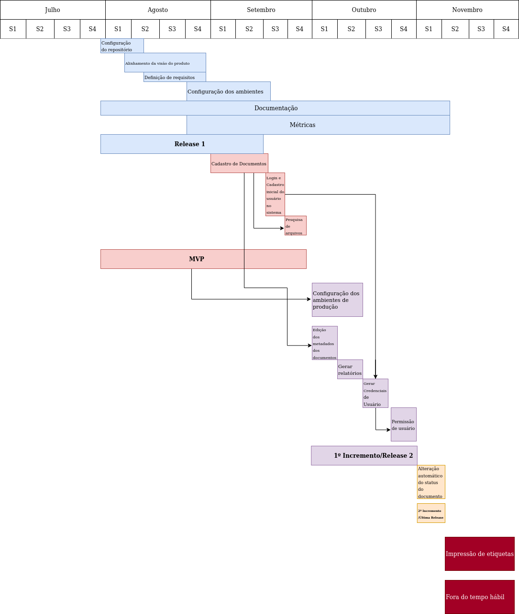
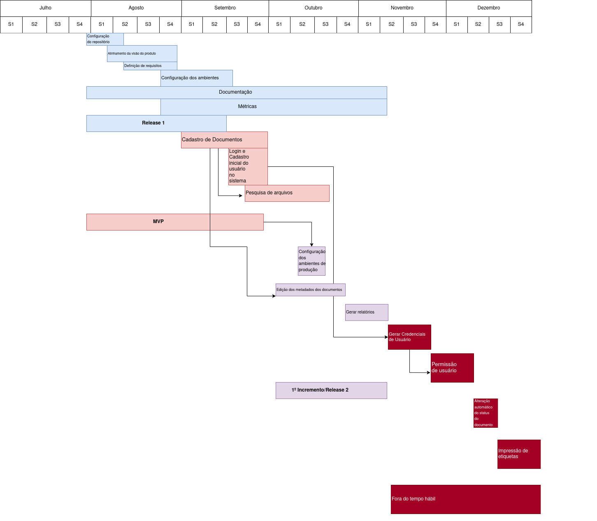

| Data | Versão | Descrição | Autor(es)|
|:----:|:------:|:---------:|:--------:|
| 09/09/21 | 1.0 | Criação do documento com o diagrama | [Ivan Diniz Dobbin](https://github.com/darmsDD) e [Paulo Vítor]((https://github.com/PauloVitorRocha)) |
| 09/10/21 | 1.1 | Adiciona versão 2 | [Ivan Diniz Dobbin](https://github.com/darmsDD)

## Introdução
Este documento tem como objetivo apresentar o gráfico de gantt com os marcos do projeto.

## Desenvolvimento
Este diagrama foi feito para facilitar o entendimento sobre o tempo de conclusão de cada marco do projeto.
Com este diagrama é possível acompanhar o desenvolvimento do projeto e permitir a visualização de possíveis atrasos que venham a ocorrer.

### Versão 1

### Versão 2
Após acompanhar o ritmo da equipe o diagrama abaixo representa os novos prazos.

## Referências
Leão, Thiago.Gráfico de Gantt: o que é, como funciona e como montar o seu. Nomus. Disponível em :<https://www.nomus.com.br/blog-industrial/grafico-de-gantt/>. Acesso em 9 de set. de 2021.
