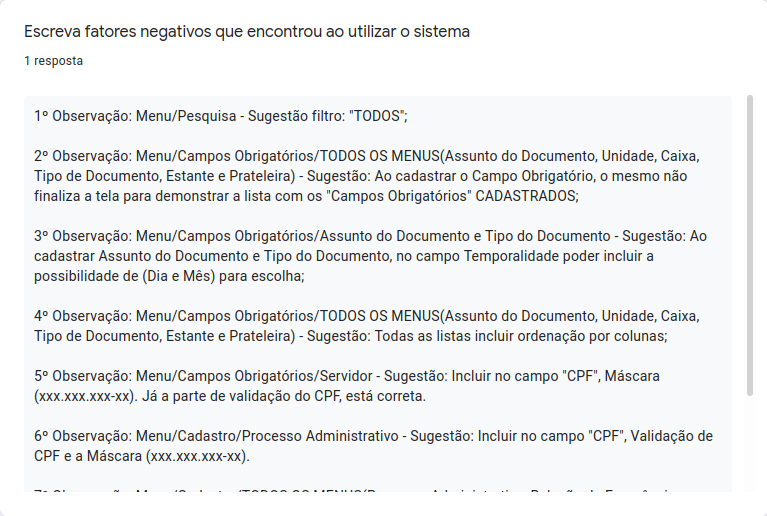

## Histórico de Revisão
| Data | Versão | Descrição | Autor(es)|
|:----:|:------:|:---------:|:--------:|
| 27/10/21 | 0.9 |  Cria o documento | [Ivan Diniz Dobbin](https://github.com/darmsDD) |
| 03/11/21 | 1.0 |  Adiciona análise sobre algumas métricas | [Ivan Diniz Dobbin](https://github.com/darmsDD) |
| 04/11/21 | 1.1 |  Adiciona resultado do formulário | [Ivan Diniz Dobbin](https://github.com/darmsDD) |

## Introdução
Este documento tem como objetivo apresentar as hipóteses de negócio planejadas na Lean Inception e quais os verdadeiros resultados obtidos pela equipe.

## Desenvolvimento
Segue uma tabela abaixo com as medidas, resultados esperados e obtidos:

| Medidas | Resultado Esperado | Resultado Obtido|
|:----:|:------:| :----------:|
|Quantidade de arquivos cadastrados no banco |100 arquivos cadastrados | 2 arquivos cadastrados |
|Quantidade de pesquisas no banco |20 pesquisas de documentos por semana | 3 pesquisas |
|Respostas dos usuários ao [formulário](https://forms.gle/6bdLCuK7Ag5gQYqn9) |1 avaliação positiva pelo usuário | 1 avaliação positiva( nota > 4 no gráfico de nível de satisfação) |

A equipe teve dificuldades com as medidas **Quantidade de arquivos cadastrados no banco** e **Quantidade de pesquisas no banco**. O usuário utilizou a plataforma mais para testes do que para o dia a dia, então o resultado obtido foi muito abaixo do esperado, porém mesmo com a quantidade de resultados reduzida, obtivemos feedback do cliente durante as reuniões semanais, permitindo assim a realização das devidas mudanças antes do fim da disciplina.

### Formulário

O cliente pareceu gostar bastante do sistema, baseado na nota 6 e nos elogios. No entanto o cliente pediu diversas alterações nos fatores negativos e isso é comum acontecer, pois quanto mais o cliente utiliza o sistema mais ele percebe o que está faltando ou o que precisa ser alterado. A equipe realizou as mudanças no software que foram solicitadas na reunião anterior, porém as alterações solicitadas no formulário não serão feitas pela falta de tempo. 

Para finalizar ,a equipe agradece os comentários finais e fica feliz que conseguiu contruir um software que o cliente tenha gostado.

