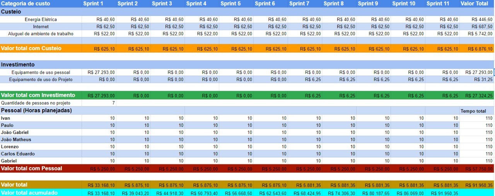
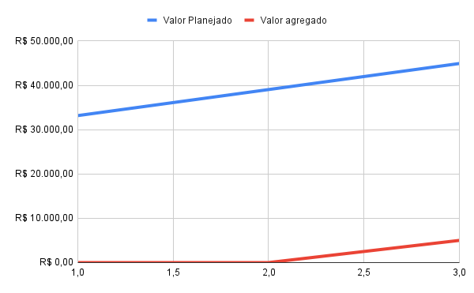

## Histórico de Revisão
| Data | Versão | Descrição | Autor(es)|
|:----:|:------:|:---------:|:--------:|
| 08/09/21 | 0.1 | Adiciona a imagem do custo | [Joao Rossi]((https://github.com/bielrossi15)) |
| 10/09/21 | 1.0 | Adiciona introdução, desenvolvimento e referências | [Ivan Diniz Dobbin](https://github.com/darmsDD) |

## Introdução
Este documento tem como objetivo apresentar a projeção de custos da equipe.

## Desenvolvimento
A equipe, após pesquisar e assistir as aulas do professor hilmer, chegou a conclusão de que a melhor maneira de calcular o custo seria utilizando os métodos do Agile EVM(Earned Value Management). 

Alguns conceitos que a equipe utilizará:

- Funcionalidades Planejadas: Quantas funcionalidades foram planejadas para a sprint ou projeto.
- Funcionalidades Concluídas: Quantas funcionalidades foram finalizadas.
- Valor Planejado: Qual o custo planejado da sprint ou do projeto. `Orçamento do Projeto * (quantidade de sprints passadas / quantidade total de sprints)`.
- Custos reais: Qual o custo real do projeto até o momento ou qual o custo real que a sprint teve.
- Valor agregado: Quanto de valor foi entregue até o momento. `Orçamento do Projeto * (total de pontos entregues / total de pontos planejados)`.
- CPI: Cost Performance Index (Índice de Desempenho de Custos) =  `Custo Real/Valor agregado`, quanto mais perto de 1 melhor.
- SPI: Schedule Perfomance Index (Índice de Desempenho de Prazo) = `Valor Agregado/Valor Planejado`, quanto mais próximo de 1 melhor.
- CPV: Cost Performance Variance (Variação de Desempenho de Custo) = `Custo Real - Valor agregado`, quanto mais próximo de 0 melhor.
- SPV: Schedule Perfomance Index (Variação de Desempenho de Prazo) =  `Valor Agregado - Valor Planejado`, quanto mais próximo de 0 melhor.

## Exemplo com nossa equipe

Será realizado um exemplo para melhor entender alguns termos.

- Total de Sprints estimadas  = 11
- Quantidade de Sprints concluídas = 3
- Total de story points estimadas = 170
- Quantidade de story points concluídas = 0
- Orçamento do projeto ou release = 100.000
- Custos até o momento = 44918.30

Pode-se perceber que existe um certo atraso pois ao dividir 170 pontos em 11 sprints temos aproximadamente
15.45 pontos por sprint.

- PV (Plan Value – Valor Planejado) = 100.000(Orçamento do Projeto) * 3(quantidade de sprints passadas) / 11(quantidade total de sprints) = 27272.72
- EV (Earned Value – Valor Agregado) = 100.000 (Orçamento do Projeto) * 13(total de pontos entregues) / 170(total de pontos planejados) = 7647.05
- SPI = 7647.05(Valor agregado) / 27272.72(Valor Planejado) = 0.2803
- SPV = 7647.05(Valor agregado) – 27272.72(Valor Planejado) = - 19625.67

- CPI = 7647.05(Valor Agregado) / 44918.30(Custo real) = 0.1702
- CPV = 7647.05(Valor Agregado) - 44918.30(Custo real) = -37271.25

A equipe teve o gasto 44918.30 reais, porém não foi gasto a mais apenas de 17727.27`(44918.30(Custo Real) - 27272.72(Valor Planejado))`. Foi gasto na realidade
`44918.30(Custo Real) - 7647.05(Valor Agregado) = 37271.25`. 

## Custo Planejado/Orçamento
Segue abaixo uma tabela com o planejamento do custo mais bem detalhado.

 

## Valor Planejado versus Valor Agregado
 

## Referências 

SULAIMAN, Tamara; BARTON, Brent; BLACKBURN Thomas. AgileEVM: Earned Value Management in Scrum Projects.**IEEE COMPUTER SOCIETY**. 2006. Disponível em: <https://github.com/fga-eps-mds/A-Disciplina-MDS-EPS/blob/master/Agil_material/AgileEVM_-_Earned_Value_Management_in_Scrum_Projects.pdf>. Acesso em 10 de set. de 2021.

MASSARI,Vitor. Gerenciamento de Valor Agregado (EVM) em Projetos Ágeis. Profissionais TI. Disponível em: <https://www.profissionaisti.com.br/gerenciamento-de-valor-agregado-evm-em-projetos-ageis/>. Acesso em 10 de set. de 2021.

Nikravan, B. & Forman, J. B. (2010). Beyond backlogs and burndowns—complementing "agile" methods with EVM for improved project performance. Paper presented at PMI® Global Congress 2010—North America, Washington, DC. Newtown Square, PA: Project Management Institute. Disponível em: <https://www.pmi.org/learning/library/earned-value-management-understand-agile-6567>. Acesso em 10 de set. de 2021.

