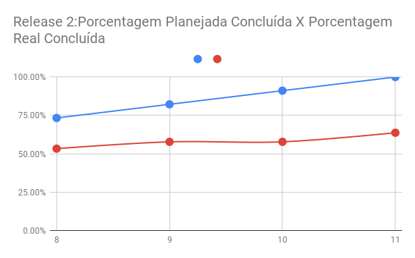
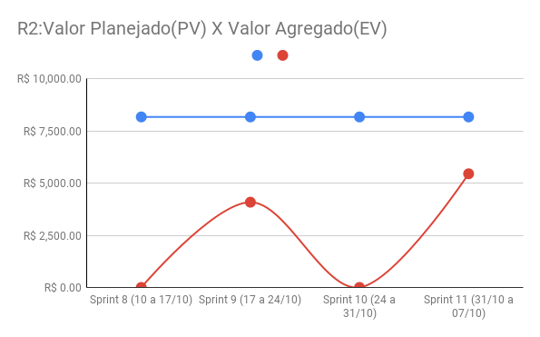
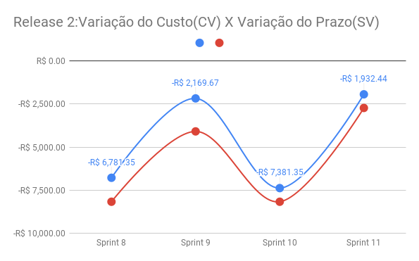
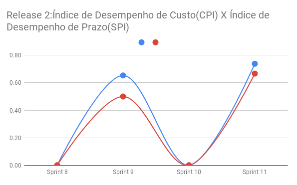
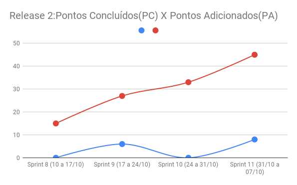

## Histórico de Revisão
| Data | Versão | Descrição | Autor(es)|
|:----:|:------:|:---------:|:--------:|
| 30/10/21 | 1.0 | Adiciona o documento |[Ivan Diniz Dobbin](https://github.com/darmsDD)

## Introdução
Este documento tem como objetivo analisar os gráficos de custo e entender seu comportamento.

## Valor Planejado(PV) X Custo Real(AC)

É possível observar nos gráficos acima que o valor planejado se mantém relativamente constante durante as sprints, nas primeiras 3 sprints com um custo de R$8,854.48 e a partir da quarta com um custo de R$8,173.36. O valor do custo real variou bastante em algumas sprints, como a 4 e 5, pois foram trabalhadas muito mais horas, o comum era trabalhar 10 horas e muitos membros trabalharam 20 horas. 

O objetivo deste gráfico é mostrar se o custo real do projeto se mantém abaixo do valor planejado, mostrando se as estimativas iniciais de custo estavam corretas.  Em nossa equipe o valor planejado ficou abaixo do custo real R$ 91,950.35(PV) X R$ 117,575.55(AC), mostrando que a equipe subestimou o custo total do projeto.

## Porcentagem Planejada Concluída(PPC) X Porcentagem Real Concluída

É possível observar nos gráficos acima que durante a release 1 não houve desenvolvimento, mantendo a porcentagem 0 durante as 3 primeiras sprints. Nas sprints 4,5,6 e 7(MVP) houve um salto no desenvolvimento, quase recuperando o atraso das sprints passadas. Nas últimas sprints(R2) ocorreu uma estagnação no desenvolvimento, sprints 8 e 9 sem nenhum desenvolvimento. Espera-se que as últimas 2 sprints sejam diferentes e a porcentagem real concluída aumente.

## Valor Planejado(PV) X Valor Agregado(EV)

Este gráfico tem relação direta com o [gráfico anterior](#porcentagem-planejada-concluidappc-x-porcentagem-real-concluida), pois também mostra o quanto do planejado foi concluído durante as sprints. A grande diferença é que este gráfico mostra de maneira objetiva os valores que a equipe planejou desenvolver e o quanto de fato desenvolveu. Assim, como observado no gŕafico anterior, é possível observar uma estagnação nas primeiras sprints(R1), uma pulo de desenvolvimento no MVP e a volta da estagnação na R2.

## Variação do Custo(CV) X Variação do Prazo(SV)

Estes gráficos mostram o desvio do custo e prazo durante as sprints.
É possível observar o desvio de prazo e custo na R1(projeto atrasado e não realizou o que deveria), notando que os valores estão todos negativos mostrando. No MVP a equipe decidiu ir atrás destes prejuízos, por isso existe um salto na sprint 6. Na release 2 houve estagnação no desenvolvimento, atrasando o projeto e mostrando os prejuízos. 

## Índice de Desempenho de Custo(CPI) X Índice de Desempenho de Prazo(SPI)

Observando a R1 é possível observar um desenvolvimento nulo, tornando 0 o CP1 e o SP1. Lembrando que quanto mais abaixo de 1 maior o atraso e prejuízo do projeto, então o 0 representa um atraso enorme e muitos prejuízos. Percebendo isso a equipe fez um esforço a mais no MVP para reduzir o atraso, mostrando índices muito acima de 1 na sprint. O índice acima de 1 representa neste caso que a equipe conseguiu desenvolver mais que o esperado durante a sprint e assim reduziu o prejuízo anterior. Na R2 houve estagnação, trazendo mais uma vez atrasos e prejuízos, assim como na R1.

## Custo Real(AC) X Valor Agregado(EV)

O gráfico acima serve para entender o quanto o projeto está custando e o quanto ele está agregando de valor durante o tempo de desenvolvimento. É possível ver apesar da equipe não conseguir desenvolver nada na R1, ainda houve um custo de desenvolvimento. No MVP a equipe finalmente começou a agregar valor ao projeto, diminuindo a diferença entre AC e EV. Na R2 houve estagnação de desenvolvimento, aumentando significamente a diferença entre o custo real e o valor agregado. Apesar da equipe reduzir a velocidade de produção na R2, o custo real não deixa de existir.

## Pontos Concluídos(PC) X Pontos Adicionados(PA)

Este gráfico mostra que durante a R1 houve um crescimento de PA pela falta de pontos concluídos. Durante o MVP houve uma redução drástica de PA, a equipe conseguiu concluir muitos pontos, reduzindo o atraso. Na R2 PA volta a crescer com os PC estagnados.

## Custo Real(AC) e Custo Estimado(BAC)

O projeto não se iniciou com sprints, foi realizado primeiramente a Lean Inception e PBB. Desta maneira é possível observar os custos iniciais do projeto nas imagens acima.
Na R1 não houve diferenças entre o custo real e o estimado, porém a partir do MVP até a R2, a equipe sentiu a necessidade de mais horas de trabalho,pois o desenvolvimento não estava indo como desejava, tornando o custo real maior que o custo estimado na maioria das sprints.

## Observação
É relatado em várias partes do documento uma estagnação da R2. Isso vem ocorrendo pois o desempenho da equipe de MDS não foi o desejado e ainda ocorreu uma baixa na equipe, resultando no desenvolvimento estagnado.

