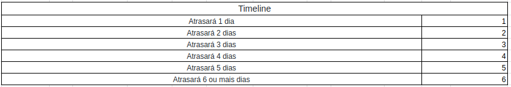

## Histórico de Revisão
| Data | Versão | Descrição | Autor(es)|
|:----:|:------:|:---------:|:--------:|
| 09/09/21 | 1.0 | Adiciona o documento sobre mitigação de riscos | [Ivan Diniz Dobbin](https://github.com/darmsDD) |
| 09/10/21 | 1.1 | Adiciona novos riscos e informa se os planos de mitigação tem funcionado | [Ivan Diniz Dobbin](https://github.com/darmsDD) |

## Introdução
Esse documento tem como objetivo apresentar como o grupo está lidando com os riscos do projeto.

## Riscos

Risco | Categoria | Timeline | Plano de mitigação | Efetivo
:-----:| :------:| :---------: | :----------:|
Ausência de membros nas atividades | 	Organização | 2 | Conversa via videochamada no qual os membros ligam as câmeras|  :white_check_mark:
Incosistência de requisitos |	Requisitos | 3 | Conversa com o cliente tentando esclarecer melhor o que ele deseja. Tirar todas as dúvidas que forem surgindo. | :white_check_mark:
Falta de conhecimento técnico da equipe |	Técnico | 6 | Treinamentos nas linguagens que estamos utilizando e pareamentos entre os membros de MDS e EPS | :white_check_mark:
Problemas Pessoais | Pessoal | 1 | Para esse risco existe a complicação de que ele é repentino. O membro com dificuldade deve tentar informar a equipe com alguns dias de antecedência. | :x:
Troca do início e término das sprints | Organização | 1 | A equipe deve ser organizar melhor para não ocorrer essa troca de datas, conversando com todos os membros para entender qual o melhor dia para o sprint planning, review e restrospective. | :white_check_mark:
Outras disciplinas | Pessoal | 1 | Os membros devem informar com antecedência semanas que estarão mais ocupados com outras disciplinas e assim não poderam contribuir muito com o projeto. | :white_check_mark:
Problemas de comunicação | Organização | 1 | Os membros devem tentar explicar melhor suas dificuldades. A equipe deve pensar em alternativas ao escutar a dificuldade do integrante da equipe | :white_check_mark:
Retrabalho por entregas mal feitas | Técnico | 6 | Os membros de MDS devem se esforçar mais para entregar os requisitos mínimos das histórias de usuário. Assim eles devem se basear no protótipo e também tirar dúvidas com os membros de EPS se a história está completa ou não.| Sem resultados até o momento
Falta de comprometimento com as tarefas | Pessoal | 6 | A equipe de EPS tem conversado com a equipe de MDS sobre o ritmo de suas entregas.  | Sem resultados até o momento
Sobrecarga de trabalho de alguns membros | Organização | - | A equipe de EPS e 1 membro de MDS tiveram uma sobrecarga muito grande nas últimas sprints, desta maneira foi decidido que a carga de trabalho seria reduzida. | Sem resultados até o momento

O timeline serve pra entender em dias quantos dias o risco custou no desenvolvimento do projeto.
  

## Referências

Risk Management in Software Engineering – Development Project Prepared For Every Threat. Asper Brothers, 27 de jan de 2020. Disponível em: <https://asperbrothers.com/blog/risk-management-in-software-development/>. Acesso em 08 de set. de 2021.

Ray, Stephanie. The Risk Management Process in Project Management. ProjectManager, 27 de fev. de 2021. Disponível
em : <https://www.projectmanager.com/blog/risk-management-process-steps>. Acesso em 09 de set. de 2021.

Neri, Hilmer; Rocha, Carla. Gestão de Portfólios e Projetos de Software: Fases ou Grupos de Processo: Planejamento II. Disponível em: <https://github.com/fga-eps-mds/A-Disciplina-MDS-EPS/blob/master/GPP_Material/06%20-%20Planejamento%20II/main.pdf>. Acesso em 09 de set. de 2021.

