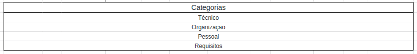
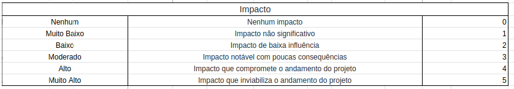
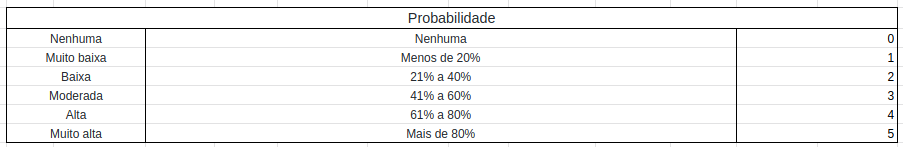
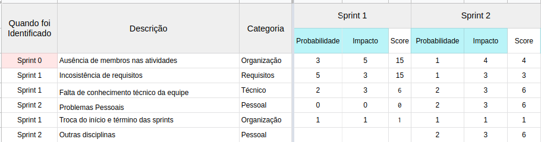
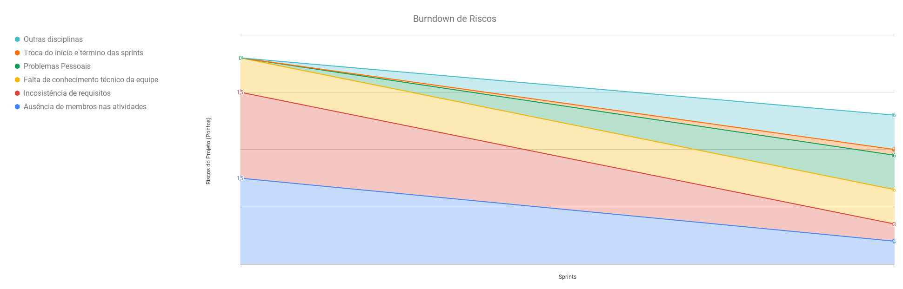

## Histórico de Revisão
| Data | Versão | Descrição | Autor(es)|
|:----:|:------:|:---------:|:--------:|
| 08/09/21 | 1.0 | Adiciona o documento sobre risco | [Ivan Diniz Dobbin](https://github.com/darmsDD) |

## Introdução
Esse documento tem como objetivo explicar como o grupo está calculando o risco do projeto.
É importante lembrar que o gerenciamento de riscos é muito importante, pois o seu má gerenciamento
pode ser a causa de projetos falharem.

## Identificação dos riscos
Para identificar os riscos o grupo utilizará as daily meetings, as reuniões sobre review,retrospective e planning
e por último as reuniões com o cliente.

- Daily Meetings: durante essas reuniões cada um fala o que fez, o que pretende fazer e os seus impedimentos. Os relatos sobre impedimentos contribuem para entender melhor riscos já observados anteriormente, ou adicionar novos riscos no `Burndown de Riscos`.
- Reunião sobre review,retrospective e planning: durante essa reunião, principalmente durante a parte do sprint retrospective, os membros podem revelar dificuldades que tiveram durante a sprint. Foi criado um formulário que também tem o intuito de entender essas dificuldades e perceber como estão os membros do time.
- Reunião com cliente: durante a reunião com cliente os principais riscos seriam a `falta de comunicação` e o `surgimento de novos requisitos`. Isso ocorre pois erros de entendimento entre o cliente e o grupo podem ocorrer e é comum surgir novos requisitos durante um projeto. Esses 2 riscos são comuns e equipe irá criar planos de mitigação para eles. Outros riscos que ainda não foram percebidos podem surgir dessa reunião.

## Métricas
O risco foi calculado com `impacto * probabilidade = nível de preocupação`. A partir dos resultados
é possível identificar facilmente quais riscos necessitam de maior prioridade no momento. Os riscos possuem 3 atributos: `nível de impacto, probabilidade e a categoria`. As categorias servem para facilitar a divisão dos riscos em suas respectivas áreas. Segue abaixo as tabelas:

 
 

## Soluções
Será criado um documento que explicará o plano de mitigação para cada risco encontrado e se este plano 
foi frutífero.

## Exemplo
Visando facilitar esse cálculo e geração de gráfico utilizamos o `Planilhas` do google no qual foi possível ter a geração automática do gráfico. Observe abaixo um exemplo do `Planilhas`.

 

No exemplo acima é possível perceber que alguns riscos diminuíram o seu nível de preocupação, `Ausência de
membros` caiu de 15 para 4, enquanto outros riscos surgiram como `Problemas Pessoais` que saiu de 0 para 6.
O nível de preocupação pode ser percebido pelo número ou pela área que o risco ocupa no gráfico.

## Referências
- Risk Management in Software Engineering – Development Project Prepared For Every Threat. Asper Brothers, 27 de jan de 2020. Disponível em: <https://asperbrothers.com/blog/risk-management-in-software-development/>. Acesso em 18 de fev de 2021.
