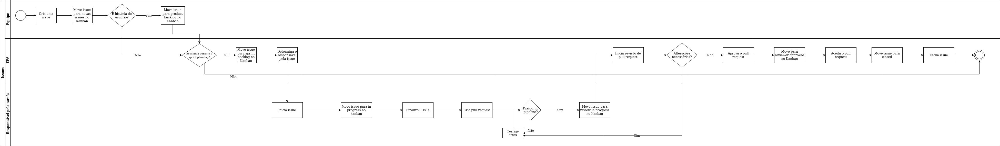

## Histórico de Revisão
| Data | Versão | Descrição | Autor(es)|
|:----:|:------:|:---------:|:--------:|
| 07/09/21 | 0.9 |  Adiciona a metodologia e processo das sprints do grupo | [Ivan Diniz Dobbin](https://github.com/darmsDD) |
| 08/09/21 | 1.0 |  Adiciona o processo de trabalho das issues do grupo | [Ivan Diniz Dobbin](https://github.com/darmsDD) |

## Introdução
Esse documento tem como objetivo apresentar os processos e metodologias do grupo.

Existem alguns artefatos que contribuem para o melhor entendimento dos processos de trabalho do grupo.

- [Agenda](agenda.md)
- [Ferramentas](ferramentas.md)

## Metodologia
A metodologia usada pelo grupo está baseado em uma mistura de métodos ágeis. Observe abaixo os elementos utilizados de cada metodologia:

### Scrum
- Sprints de 7 dias.
- Reunião sobre sprint planning aos domingos.
- Reunião sobre sprint review aos domingos.
- Reunião da sprint retrospective aos domingos.
- Entregas incrementais.
- Product backlog e sprint backlog.
- Daily meetings.
- Critérios de aceitação.

### Kanban

- Para a divisão de tarefas no estilo Kanban utilizamos o zenhub.
- Transparência do fluxo de trabalho.
- Captura de métricas de produtividade, como a visualização do workflow através dos gráficos de cumulative flow.
- Limitação da quantidade de trabalho por membro.
- Utilização de políticas claras.
- Delimitação de responsáveis para cada tarefa.

### XP
- Teste unitários.
- Testes de aceitação.
- Refatoração, se necessário.
- Utilização de pareamentos.
- Feedback constante.
- Integração Contínua.
- Pequenas releases.

### Observação
Por experiência pessoal dos membros, foi decidido utilizar um formato de 3 reuniões por semana, pois muitas vezes reuniões diárias eram improdutivas. Esse formato pode sofrer alterações.

## Processos das sprints

Observe na imagem abaixo o fluxograma de trabalho que é utilizado durante uma sprint.

## Processo das issues

Observe abaixo o fluxograma de trabalho que é realizado desde a criação até finalização de uma issue.

## Referências

Main Features and Characteristics of Successful Kanban Teams. Kanbanize. Disponível em:<https://kanbanize.com/blog/characteristics-of-kanban/>. Acesso em 7 de set. de 2021.

Neri, Hilmer; Rocha, Carla.GPP & MDS:Time Ágil. Disponível em: <https://github.com/fga-eps-mds/A-Disciplina-MDS-EPS/blob/master/Agil_material/11%20-%20AgilePlanning/main.pdf>. Acesso em 7 de set. de 2021. 

Scrum // Dicionário do Programador. Código Fonte TV. Disponível em <https://www.youtube.com/watch?v=3aCww_1RnL0>.
Acesso em 7 de set. de 2021.

Schimiguel, Juliano. Agile Development: XP e Scrum em uma Abordagem Comparativa. DEVMEDIA. Disponível em <https://www.devmedia.com.br/agile-development-xp-e-scrum-em-uma-abordagem-comparativa/30808>. Acesso em 7 de set. de 2021.

