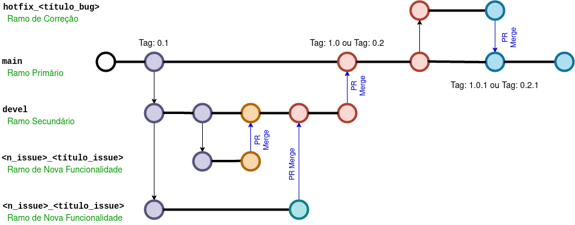
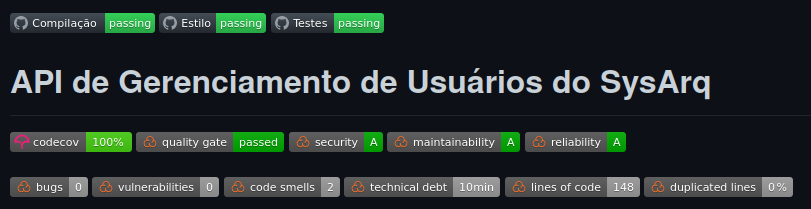

<h1 style="text-align: center">Pipeline de Integração e Entrega</h1>

|   Data   | Versão |  Descrição  | Autor(es)|
|  :----:  | :----: | :---------: |:--------:|
| 16/09/21 |  0.1   | Versão inicial do documento | [Matheus](https://github.com/J-Matheus) |
| 16/09/21 |  0.2   | Adiciona a descrição do Fluxo do Repositório e Github Actions | [Matheus](https://github.com/J-Matheus) |
| 11/11/21 |  1.0   | Versão final do documento | [Matheus](https://github.com/J-Matheus) |

## Introdução

Este documento apresenta o Pipeline de Integração e Entrega utilizado nos repositórios do projeto.

## Fluxo do Repositório

O fluxo do repositório é muito importante para o gerenciamento do trabalho de uma equipe. Esse fluxo permite o desenvolvimento concorrente de funcionalidades e o isolamento de ambientes.

### Escolha - Repositórios de Desenvolvimento

|  Indicado para   | *GitFlow* |    *GitHub Flow*   |
| :--------------: | :-------: | :----------------: |
| Entrega Contínua |    :x:    | :white_check_mark: |
|   Versão Única   |    :x:    | :white_check_mark: |

### *GitHub Flow*

O guia do GitHub define esse fluxo da seguinte forma: 

> GitHub flow is a lightweight, branch-based workflow that supports teams and projects where deployments are made regularly.

Na imagem abaixo, vemos como foi configurado o fluxo dos repositórios de código fonte.

Podemos destacar as seguintes características nesse fluxo:

- Dois ramos (*branchs*) permanentes:
    - *main*: ambiente de produção;
    - *devel*: ambiente de homologação.

- As mudanças da *devel* que são fundidas (*Pull Request merge*) na *main*  não geram *release* **ou** geram uma *release* (*major* ou *minor*).

- As mudanças de um ramo do tipo *hotfix* que são fundidas (*Pull Request Merge*) na *main* geram uma *release* *patch*.

- O desenvolvimento de novas funcionalidades e de correções pode ser realizado de maneira simultânea.

### Fluxo do Repositório de Documentação

No repositório de documentação, utilizamos um *GitHub Flow* adaptado. Esse *GitHub Flow* adaptado é menos restrito, pois:

- Não possui ambiente de desenvolvimento;

- Permite que os administradores do respositório realizem *push* de *commits* na *branch* *main*.

## *GitHub Actions*

As *actions* automatizam trabalhos no fluxo de repositório. Em nossos repositórios, utilizamos seis *actions*.

- No repositório de documentação, utilizamos a *action* de *Deploy* (*deploy* da página de documentação).

- Nos repositórios de desenvolvimento, utilizamos as *actions* de Compilação, Estilo, Testes, Nova Versão e Implantação.

### *Deploy*

A *action* de *Deploy* é executada em todo *push* na *main*. E, como dito anteriormente, realiza o *deploy* da página de apresentação e documentação do projeto.

### Compilação, Estilo e Testes

As *actions* de Compilação, Estilo e Testes são executadas em todo *pull request* para *main* ou *devel* e em todo *push* para *main* ou *devel*.

A Compilação verifica se o *up* do *container* ocorre sem erros.

A Estilo verifica se o código fonte do projeto segue o estilo de código definido.

E a Testes executa os testes, executa o escaneamento do *SonarCloud* e envia o relatório de cobertura de código para o *codecov*.

### Implantação

A *action* de Implantação realiza o deploy das alterações no *heroku* (ambiente de desenvolvimento). Essa *action* executa em todo *push* realizado na *devel*.

### Nova Versão

A *action* de Nova Versão é executada em todo *pull request* fundido na *main*.

A Nova Versão verifica a necessidade de gerar uma nova versão, verifica que tipo de versão deve ser gerada, coleta as métricas calculadas pelo *SonarCloud* no escaneamento, cria uma *Release* (versão) com o arquivo das métricas no *Assets* e envia o arquivo das métricas para o repositório de documentação.

## Referências

Understanding the GitHub flow. Disponível em: [https://guides.github.com/introduction/flow/](https://guides.github.com/introduction/flow/). Acesso em: 16 set. de 2021.
