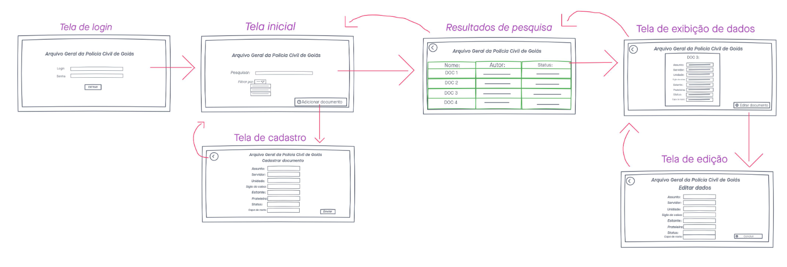

# Protótipos de Baixa e Alta Fidelidade

## Visão do Protótipo de Baixa Fidelidade
 

**Fluxo básico:**
- Usuário loga na plataforma
- Na tela principal ele segue um de dois fluxos
  1. Cadastra documento, preenchendo informações e salvando.
  2. Fazendo uma pesquisa para encontrar algum documento específico.

**Fluxo cadastro:**
- Na tela principal, usuário clica em cadastrar documento.
- Usuário cadastra o documento e clica no botão de salvar.

**Fluxo pesquisa:**
- Usuário pesquisa um documento e o sistema retorna uma lista de documentos que se encaixam na pesquisa.
- Usuário ordena a pesquisa por algum parametro (padrão, nome, quem cadastrou, etc).

**Fluxo edição de documentos:**
- Após o retorno da pesquisa, usuário pode editar dados de algum documento.
- Usuário clica na célula do documento escolhido.
- Usuário clica no botão de editar documento.
- Usuário altera informações que deseja e salva as alterações.
