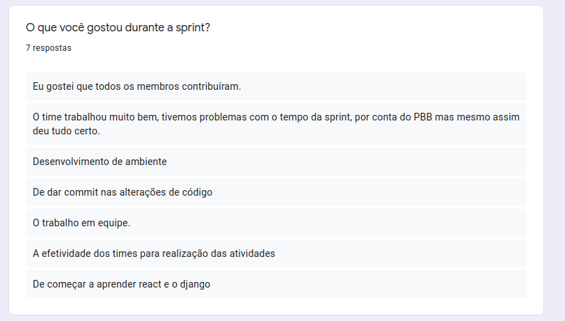
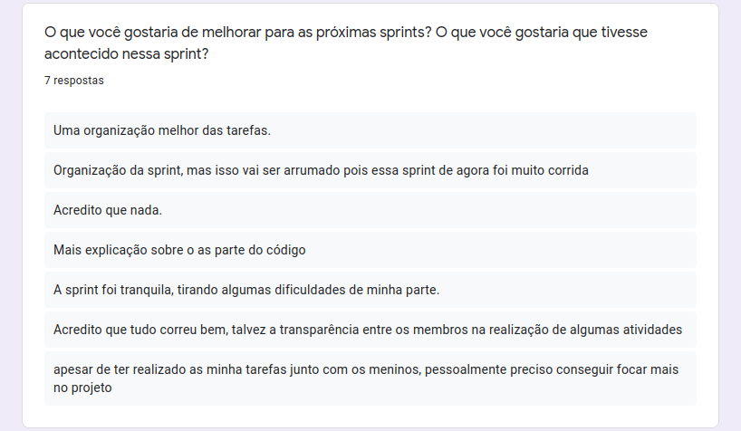
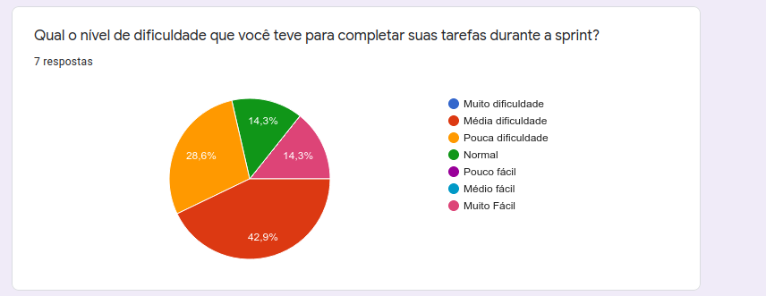
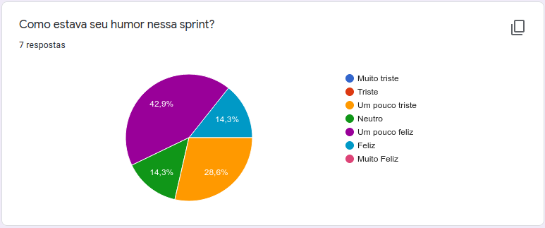

# Sprint Restrospective

## Histórico de Revisão
| Data | Versão | Descrição | Autor(es)|
|:----:|:------:|:---------:|:--------:|
| 25/08/21 | 0.7 | Adiciona a retrospetiva parcial da Sprint | [Ivan Diniz Dobbin](https://github.com/darmsDD), [João Rossi](https://github.com/bielrossi15) |
| 29/08/21 | 0.8 | Adiciona os gráficos e perguntas | [Ivan Diniz Dobbin](https://github.com/darmsDD)|

## Análise do Scrum Master

Essa sprint teve menos reuniões de grupo em comparação quando foi montado a Lean Inception e o Product Backlog Building. O fato de ter menos reuniões de longa duração pareceu melhorar a produtividade da equipe que estavam desgastados com 3 a 4 reuniões semanais durando geralmente 2 horas.

Observasse pelo questionário que uma das problemáticas da sprint foi de fato a organização. É possível observar também uma distoância com as dificuldades, com uma boa parte tendo `média dificuldade` e uma parcela menor com `muito fácil`, o ideal é que o gráfico fica mais perto da dificuldade `normal`, assim evita membros terem tarefas muito difíceis e outros muito fáceis. Os membros da equipe em sua maioria estavam acima da média no gráfico de humor, com uma porcentagem considerável em `pouco triste`. Espera-se que a maioria dos neutros fique de `neutro` para cima, pois quanto mais perto de `muito triste` é possível ter queda de desempenho. 

Os riscos dessa sprint eram em relação ao membro Carlos, porém foi discutido dia 23/08/2021 juntamente ao professor uma mudança de atitude. Essa reunião parece ter tido efeito pois Carlos foi mais presente no resto da sprint, é esperado que esse risco suma para as próximas sprints.

## Pontos Levantados

## Dificuldades

## Humor

