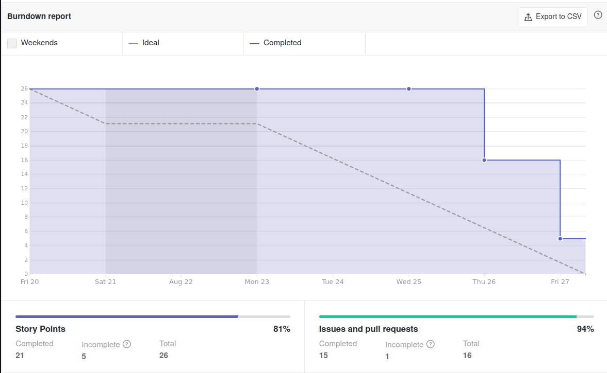
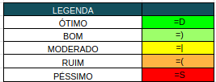

# Sprint Review

## Histórico de Revisão
| Data | Versão | Descrição | Autor(es)|
|:----:|:------:|:---------:|:--------:|
| 25/08/21 | 0.1 | Adiciona histórico de revisão, análise do Scrum Master e começa a preencher os riscos e o conhecimento dos membros  | [Ivan Diniz Dobbin](https://github.com/darmsDD), [João Rossi](https://github.com/bielrossi15) |
| 29/08/21 | 0.2 | Adiciona os gráficos do velocity e burndown| [Ivan Diniz Dobbin](https://github.com/darmsDD) |

## Quando
Essa sprint se iniciou no dia 20/08/2021 e durou 7 dias terminando dia 27/08/2021 

## Análise do Scrum Master
A primeira sprint foi destinada a montagem do ambiente e a produção do backlog. 
Foi percebido um bom ritmo de trabalho com todos os membros realizando seus papéis e 
as tarefas sendo concluidas.**Explicar com o velocity e burndow** A equipe de EPS acabou trabalhando mais pois necessitava arrumar a documentação e o ambiente antes que MDS pudesse iniciar os códigos.

## Riscos
- Presença do membro Carlos nas atividades.

## Burndown

## Velocity

## Conhecimento dos Membros

### Antes

### Depois

