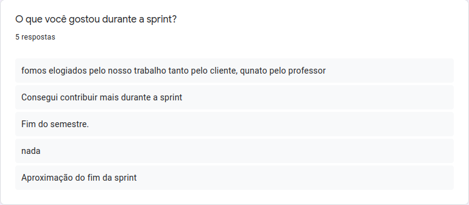
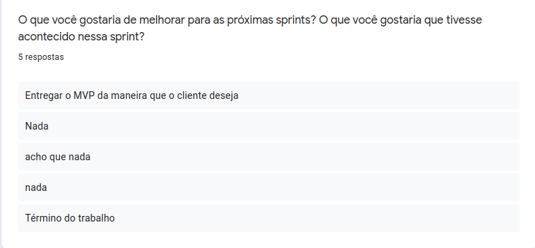
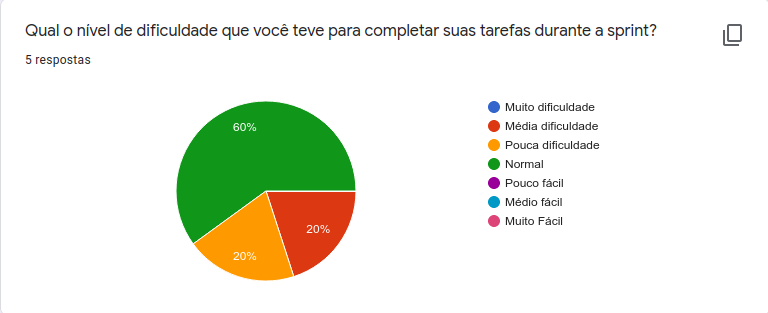
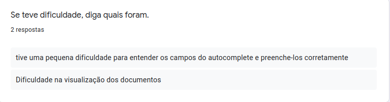
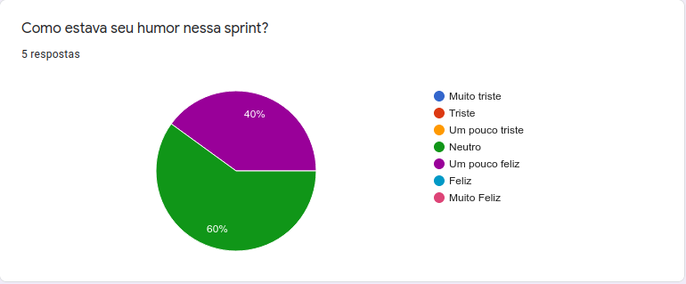

<h1 style="text-align: center">Sprint Restrospective</h1>

## Histórico de Revisão
| Data | Versão | Descrição | Autor(es)|
|:----:|:------:|:---------:|:--------:|
| 05/11/21 | 1.0 | Adiciona a retrospectiva |[Ivan Diniz Dobbin](https://github.com/darmsDD)|

## Análise do Scrum Master

Observe em [pontos levantados](#pontos-levantados) que a equipe ficou contente com os elogios do professor e do cliente, alguns membros gostaram que conseguiram participar mais durante a sprint e outros estão contentes que o semestre está quase no fim.

Em [dificuldades](#dificuldades) é possível quer que a maioria dos membros está sem muitos problemas para realizar suas issues, com 1 ou 2 membros com um pouco mais de dificuldade.

A equipe relatou nos [pontos levantados](#pontos-levantados) que espera entregar as melhorias que o cliente pediu nas últimas reuniões. 

O [humor](#humor) mostra que a maioria dos membros está aguentando bem esse fim de semestre.

## Pontos Levantados

## Dificuldades

## Humor

