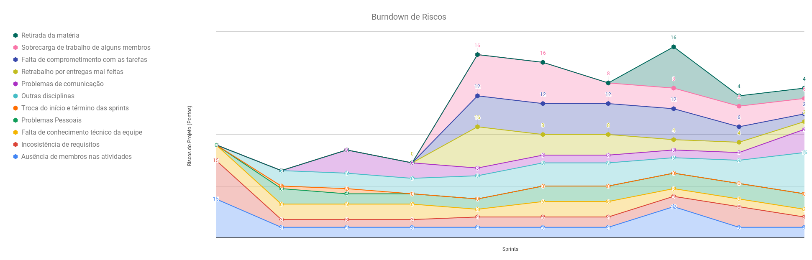
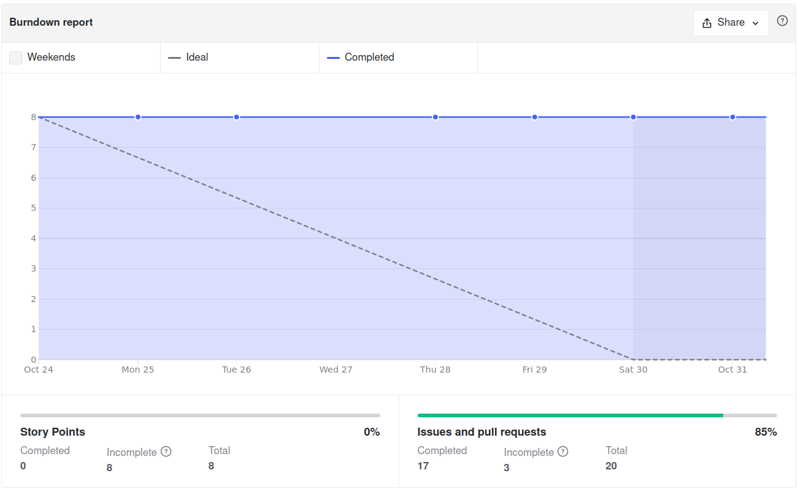
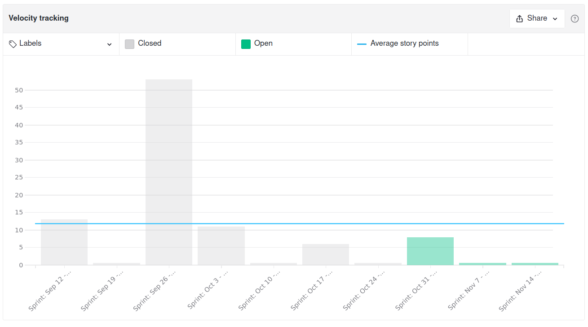
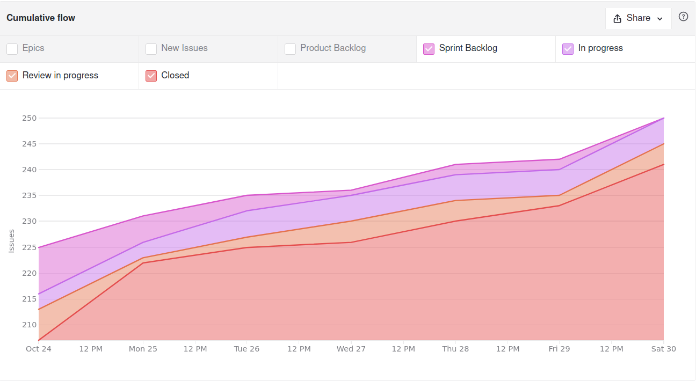
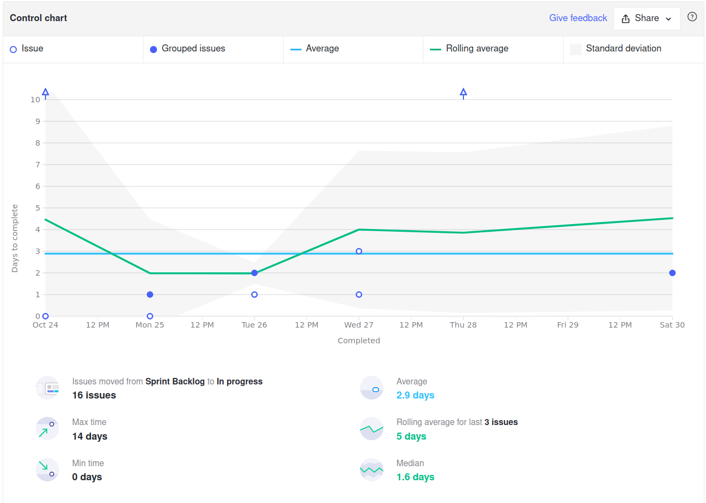
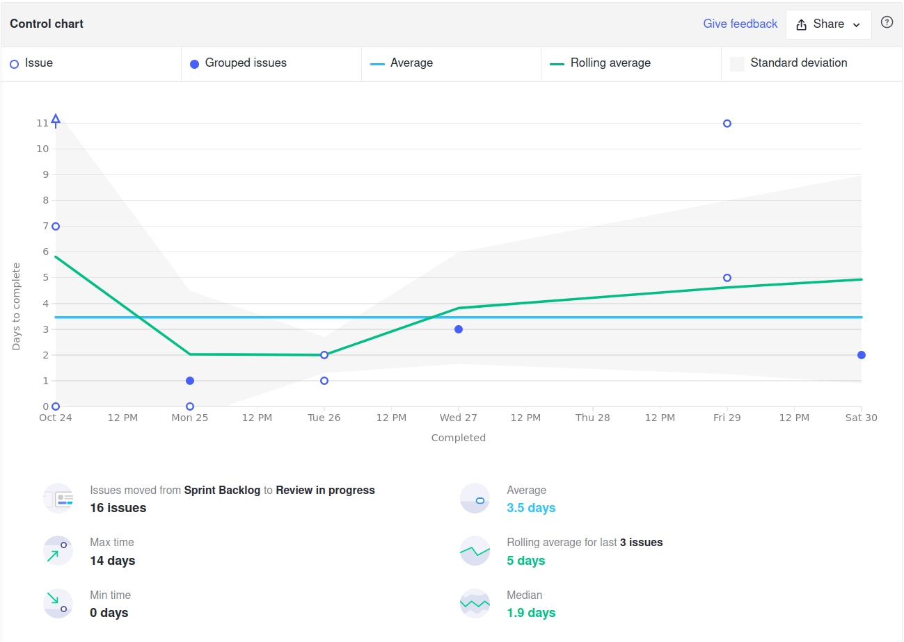
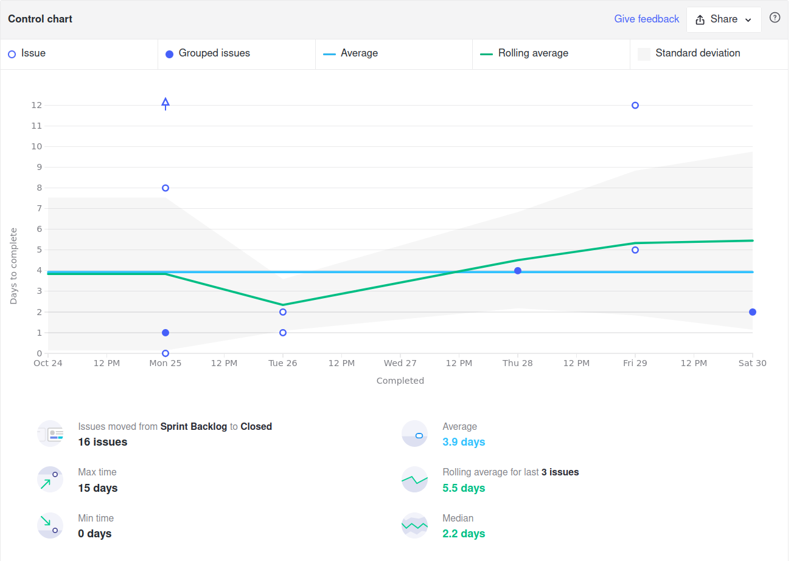
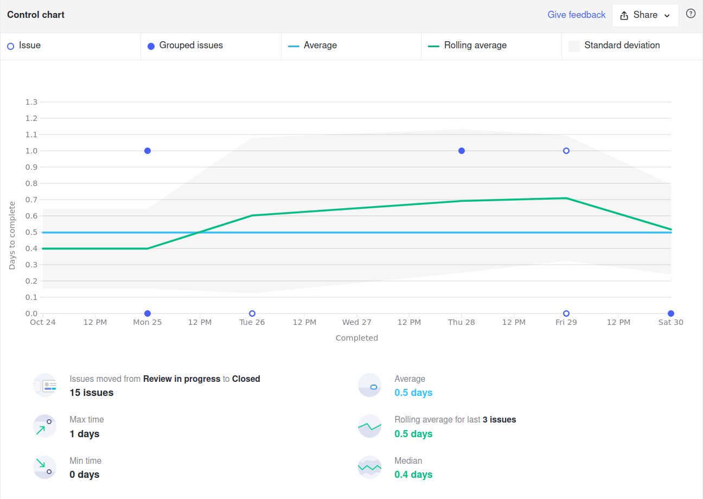
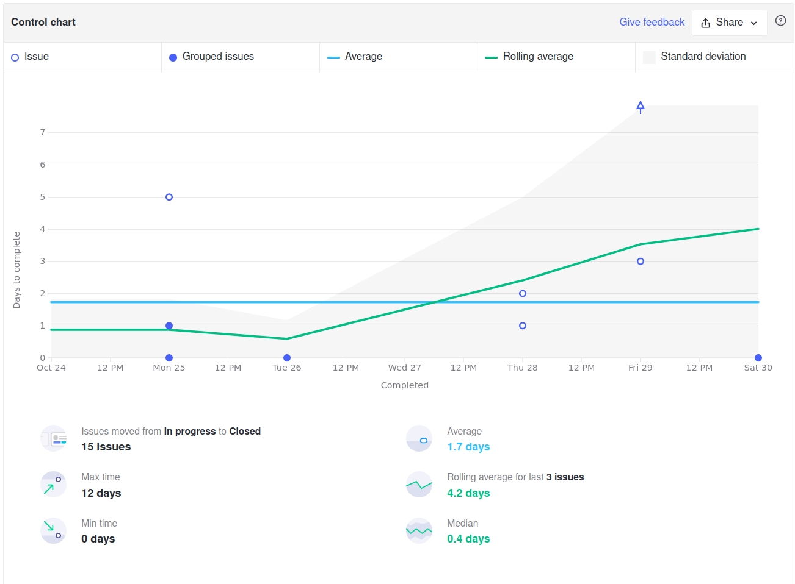
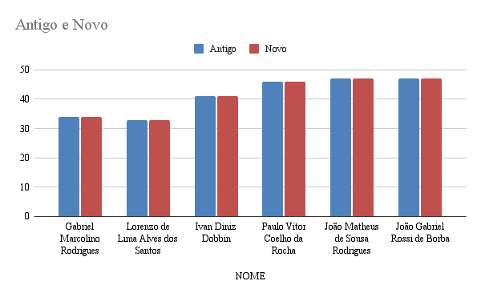

<h1 style="text-align: center">Sprint Review</h1>

## Histórico de Revisão
| Data | Versão | Descrição | Autor(es)|
|:----:|:------:|:---------:|:--------:|
| 05/11/21 | 1.0 | Adiciona o Review | [Ivan Diniz Dobbin](https://github.com/darmsDD) |

## Quando
Essa sprint se iniciou no dia 24/10/2021 e durou 7 dias terminando dia 31/10/2021

## Análise do Scrum Master

A maioria das issues foram finalizadas nesta sprint, apenas a issue [Atualizar Analytics](https://github.com/fga-eps-mds/2021.1-pc-go1/issues/142) não foi finalizada pois o time decidiu que essa issue deveria se repetir até o final. Observe no [burndown](#burndown) que apesar de nenhuma issue de pontuação ser concluída, a equipe completou 17 de 20 issues. Como esta é a penúltima semana, espera-se que a US06: [Visualizar detalhes de um documento](https://github.com/fga-eps-mds/2021.1-pc-go1/issues/53) seja concluída antes do fim do semestre.

Observando o gráfico de [riscos](#riscos) que a maioria dos riscos diminuiram, porém o risco **Outras disciplinas** aumentou consideravelmente. Isso acontece pois o semestre está acabando, então ocorre sobrecarga de outras matérias neste período final, os outros riscos tem diminuído pois a probabilidade deles acontecerem foi reduzida.

Como não existiram pontos o [velocity](#velocity) fica cada dia mais distoante, sprints com 0 pontos e sprints com 53 pontos.

O [cumulative flow](#cumulative-flow) mostra que muitas issues foram concluídas bem no início e no final da sprint. Acredito que por serem dias do final de semana, domingo e sábado, a equipe teve mais tempo para realizar issues. O ritmo reduzido durante a semana deve ter sido afetado pelo risco **outras matérias**. Assim os membros da equipe estão priorizando finalizar as tarefas de outras disciplinas que tem o prazo antes do fim da sprint.

Alguns pontos importantes para se observar dos [Control Charts](#control-charts):
    
- [1](#ciclo-de-uma-issue-sair-de-sprint-backlog-ate-in-progress): O tempo de início das issues se manteve em 2.9 dias, indicando que a equipe tem tentado iniciar as issues no começo da sprint. 
- [2](#ciclo-de-uma-issue-sair-de-sprint-backlog-ate-review-in-progress): A média reduziu de 5 para 3.5 dias, indicando que a equipe tem realizado com mais velocidade suas issues.
- [3](#ciclo-de-uma-issue-sair-de-sprint-backlog-ate-closed): O tempo de conclusão reduziu novamente, de 5 dias para 3.9 dias.  
- [4](#ciclo-de-uma-issue-sair-de-review-in-progress-ate-closed): As issues continuam sendo corrigidas rapidamente, com média de menos de 1 dia. 
- [5](#ciclo-de-uma-issue-sair-de-in-progress-ate-closed): A equipe tem demorado em média 1.7 dias para completar uma issue depois de inicia-la. Isso indica um bom desenvolvimento, pois geralmente cada membro fica responsável por no mínimo 2 a 3 issues, permitindo a conclusão de todas em tempo hábil.

Por último é importante ressaltar o quadro de conhecimento, observe que o time teve uma estagnação. Isso é comum, pois apesar do conhecimento crescer, muitas vezes não é o suficiente para subir na escala, exemplo: um membro tem nota 4 e adquiriu novos conhecimentos no tópico, porém não o suficiente para subir para a nota 5. O incremento da nota de 4 para 5 está sendo mais difícil que os incrementos anteriores.

## Riscos

## Burndown

## Velocity

## Cumulative Flow

## Control Charts

### Ciclo de uma issue sair de sprint backlog até in progress

### Ciclo de uma issue sair de sprint backlog até review in progress

### Ciclo de uma issue sair de sprint backlog até closed

### Ciclo de uma issue sair de review in progress até closed

### Ciclo de uma issue sair de in progress até closed

## Conhecimento dos Membros

