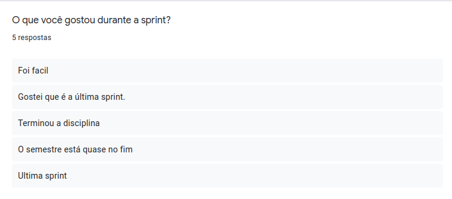
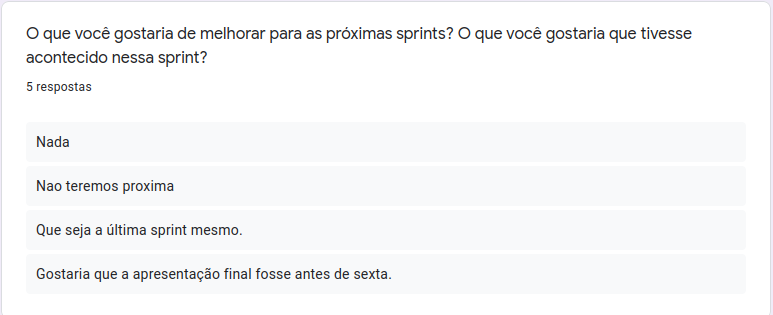
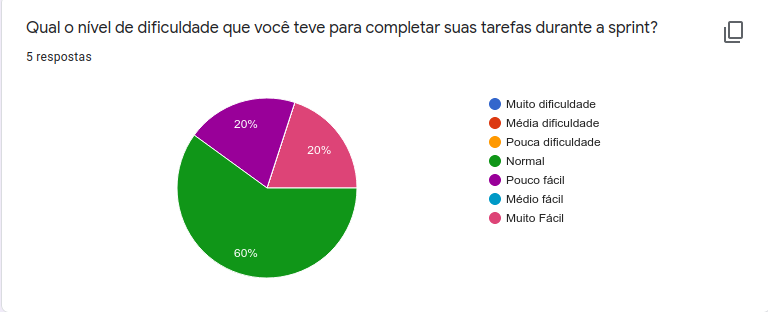
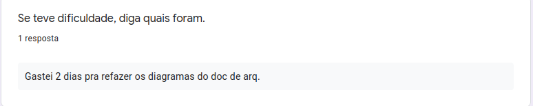
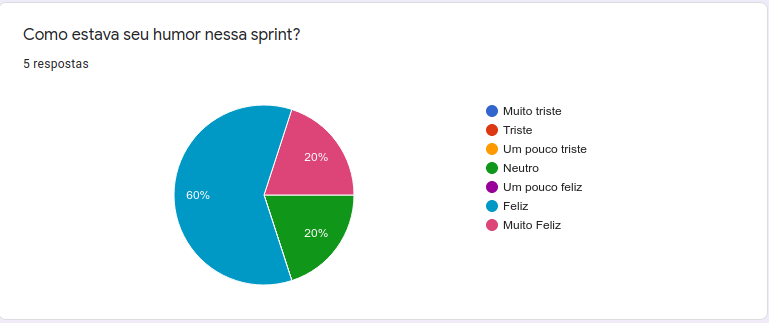

<h1 style="text-align: center">Sprint Restrospective</h1>

## Histórico de Revisão
| Data | Versão | Descrição | Autor(es)|
|:----:|:------:|:---------:|:--------:|
| 07/11/21 | 1.0 | Adiciona a retrospectiva |[Ivan Diniz Dobbin](https://github.com/darmsDD)|

## Análise do Scrum Master

Observe em [pontos levantados](#pontos-levantados) que a equipe está contente que esta é a última sprint. Essa melhora do humor pode ser visto no [gráfico de humor](#humor), com a maioria dos membros felizes.

Em [dificuldades](#dificuldades) é possível ver que apenas 1 membro teve maiores dificuldades, isso aconteceu pois ele teve que realizar diversas atualizações no documento de arquitetura.

A equipe relatou nos [pontos levantados](#pontos-levantados) que espera que esta seja de fato a última sprint. Esta foi a última sprint, a equipe tem como última tarefa treinar para a apresentação que ocorrerá no dia 12/11/2021.

## Pontos Levantados

## Dificuldades

## Humor

