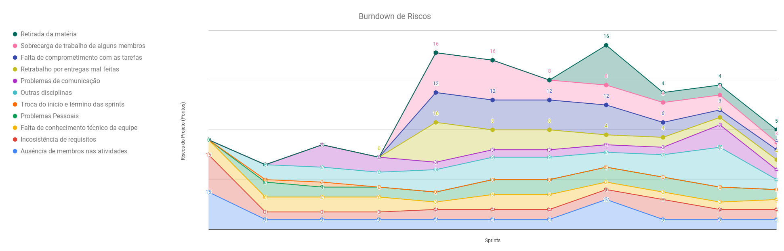
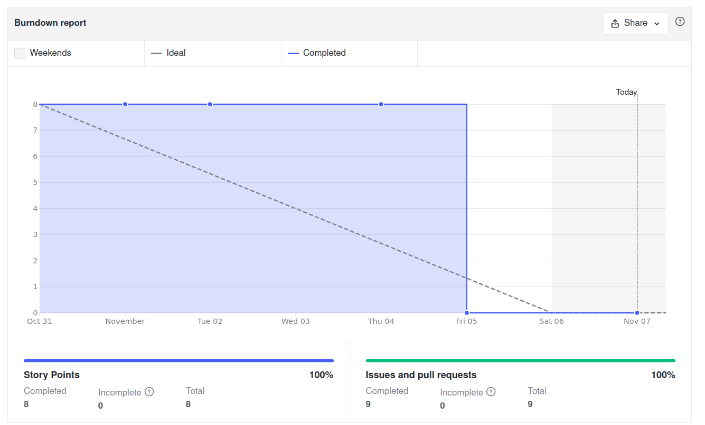
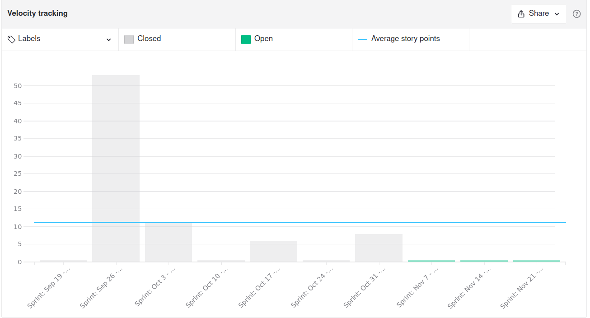
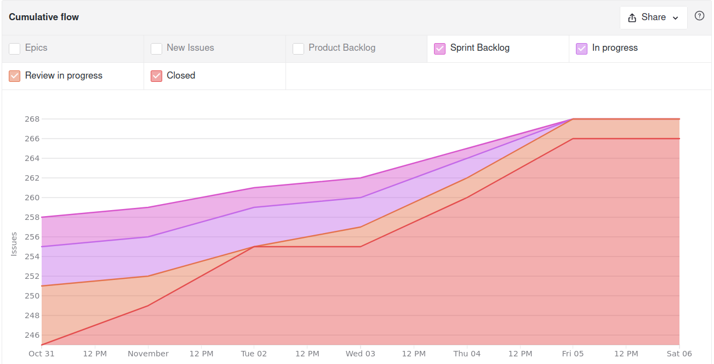
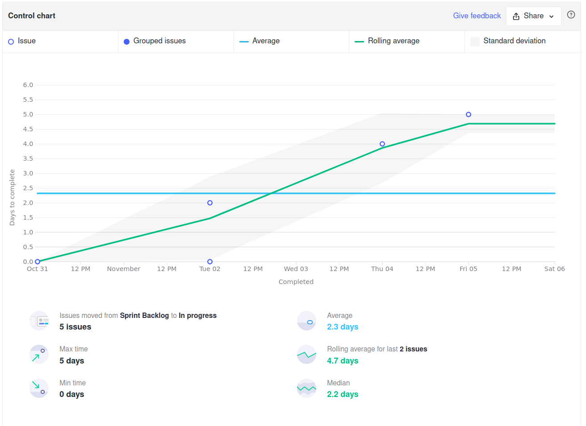
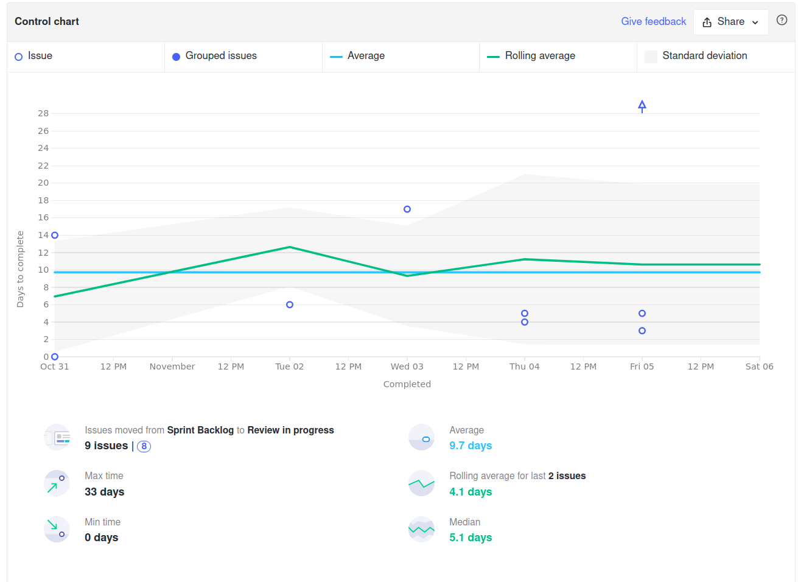
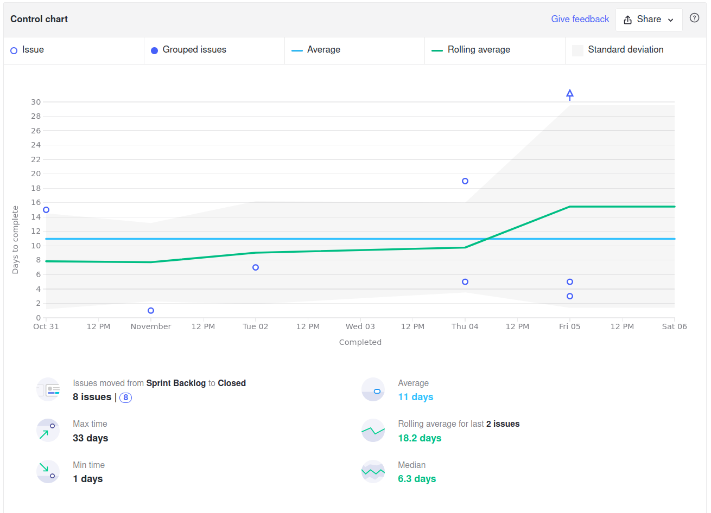
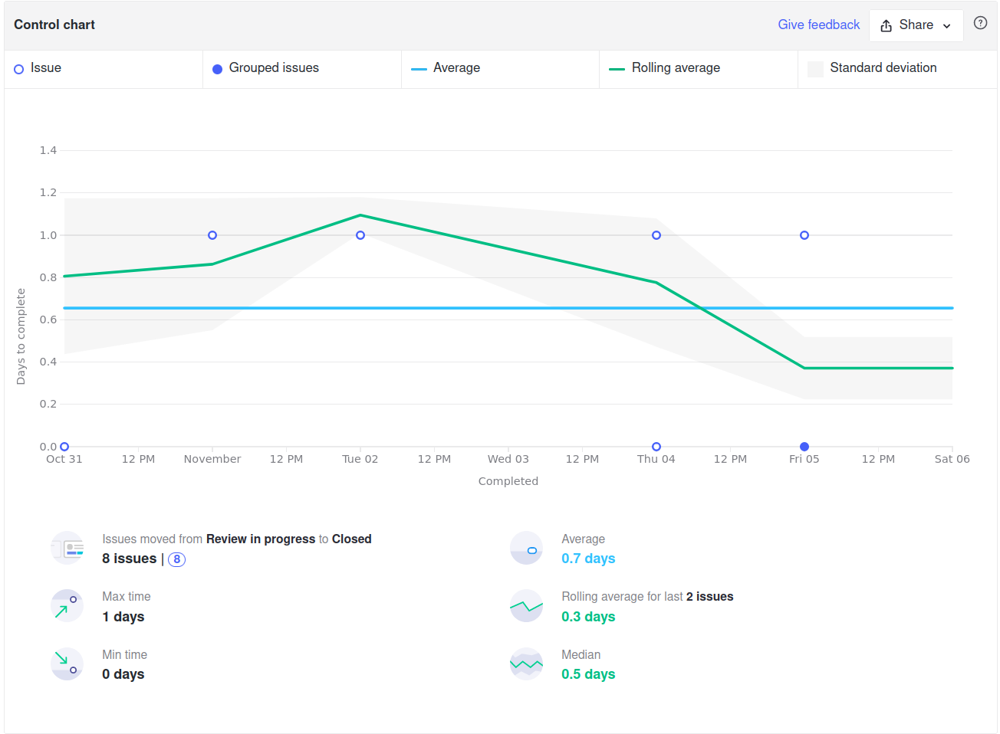
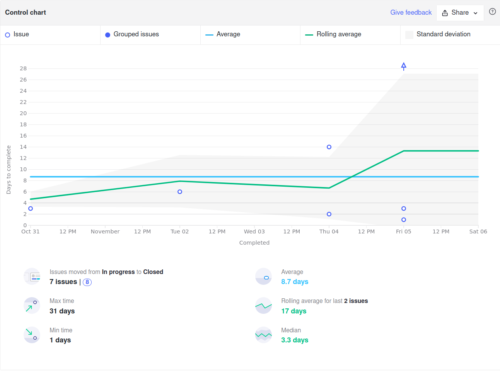
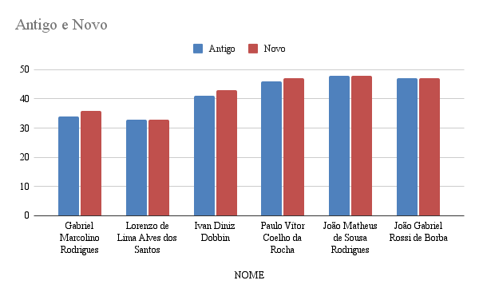

<h1 style="text-align: center">Sprint Review</h1>

## Histórico de Revisão
| Data | Versão | Descrição | Autor(es)|
|:----:|:------:|:---------:|:--------:|
| 07/11/21 | 1.0 | Adiciona o Review | [Ivan Diniz Dobbin](https://github.com/darmsDD) |

## Quando
Essa sprint se iniciou no dia 31/10/2021 e durou 7 dias terminando dia 07/11/2021

## Análise do Scrum Master

Nesta última sprint a equipe conseguiu finalizar todas as issues, incluindo a US06 que era a única issue pontuada. Um dos grandes motivos para isso foi a redução do risco **Outras disciplinas**.A equipe realizou 8 pontos nessa sprint e completou 9 issues.

Observando o gráfico de [riscos](#riscos) que a maioria dos riscos diminuiram, pois a chance deles ocorrerem diminui significamente.

A média apresentada no [velocity](#velocity) ficou de 11.14 pontos, porém uma análise mais cuidadosa vai revelar que a maioria das sprints não tem pontuação, assim ao realizar o cálculo da mediana com as últimas sprints, chegamos ao valor de 6 pontos. 

O [cumulative flow](#cumulative-flow) mostra que as issues foram concluídas ao longo da sprint. Em sprints anteriores esse comportamente não tinha sido observado, muitas issues terminavam no inicio ou final da sprints ao invés de um término gradual ao longo da sprint.

O [Control Charts](#control-charts) desse sprint mostrará tempos bem diferentes de sprints anteriores. Isso aconteceu pois issues que demoraram várias sprints para serem finalizadas terminaram nesta sprint, como a **US06** e **atualizar analytics**. Assim os tópicos **2, 3 e 4** abaixo sofreram grandes variações:
    
- [1](#ciclo-de-uma-issue-sair-de-sprint-backlog-ate-in-progress): O tempo de início das issues reduziu para 2.3 dias, indicando que a equipe tem tentado iniciar as issues no começo da sprint. 
- [2](#ciclo-de-uma-issue-sair-de-sprint-backlog-ate-review-in-progress): A média subiu de 3.5 para 9.7 dias.
- [3](#ciclo-de-uma-issue-sair-de-sprint-backlog-ate-closed): O tempo de conclusão subiu de 3.9 para 11 dias.  
- [4](#ciclo-de-uma-issue-sair-de-review-in-progress-ate-closed): As issues continuam sendo corrigidas rapidamente, com média de menos de 1 dia. 
- [5](#ciclo-de-uma-issue-sair-de-in-progress-ate-closed): A média subiu de 1.7 dias para 8.7 dias.

Por último é importante ressaltar o quadro de conhecimento, a maior parte do time continou estagnada, porém foi possível observar um crescimento de conhecimento nesta última sprint.

## Riscos

## Burndown

## Velocity

## Cumulative Flow

## Control Charts

### Ciclo de uma issue sair de sprint backlog até in progress

### Ciclo de uma issue sair de sprint backlog até review in progress

### Ciclo de uma issue sair de sprint backlog até closed

### Ciclo de uma issue sair de review in progress até closed

### Ciclo de uma issue sair de in progress até closed

## Conhecimento dos Membros

