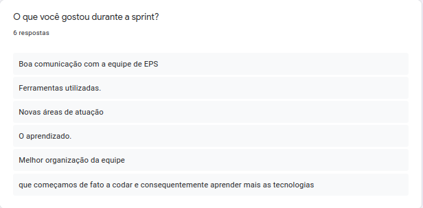
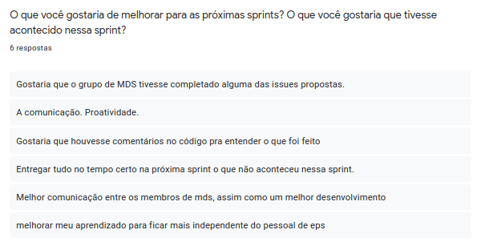
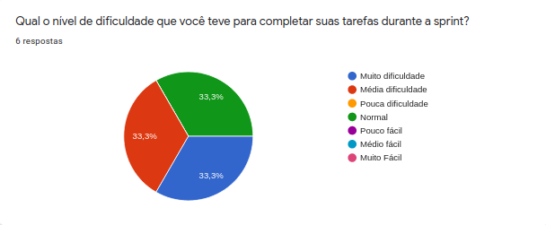
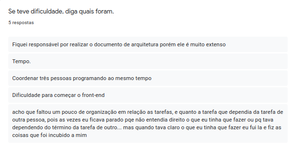
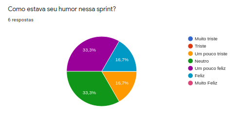

# Sprint Restrospective

## Histórico de Revisão
| Data | Versão | Descrição | Autor(es)|
|:----:|:------:|:---------:|:--------:|
| 06/09/21 | 1.0 | Adiciona a retrospectiva | [Ivan Diniz Dobbin](https://github.com/darmsDD)|

## Análise do Scrum Master

Nessa sprint houve uma melhora de comunicação entre os membros da equipe, porém houve problemas
na comunicação entre os membros de MDS. Isso foi discutido em reunião e esperasse melhorias. Foi observado também uma dificuldade de membros de EPS que tiveram que trabalhar com 3 MDS ao mesmo tempo, assim tentaremos uma separação entre duplas, EPS + MDS e MDS+MDS.

O humor nessa sprint está melhor do que na sprint anterior, acredito que os membros estejam mais entrosados.

Por último percebemos um aumento na dificuldade para completar as tarefas, isso se comprova com a falta de completude de algumas issues. A dificuldade maior veio por parte dos membros de MDS que estavam codificando pela primeira vez, assim surgiram muitas dúvidas e até certa dependência de EPS. Esperasse que o nível de dificuldade fique entre pouca dificuldade e pouco fácil, assim para a próxima sprint tentaremos resolver isso.

## Pontos Levantados

## Dificuldades

## Humor

