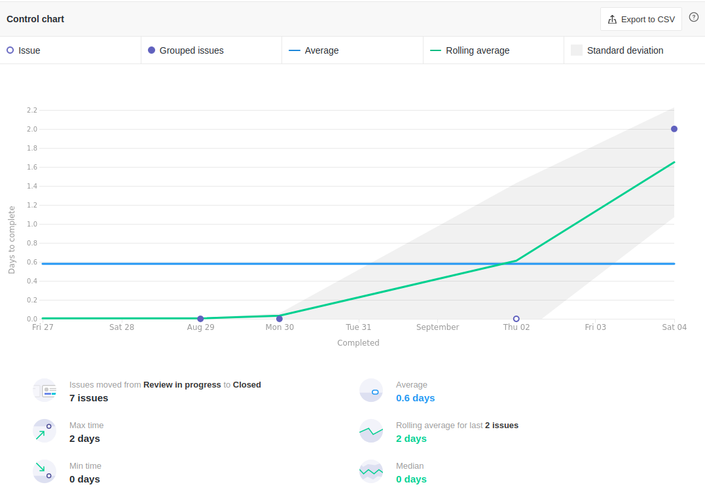

<h1 style="text-align: center">Sprint Review</h1>

## Histórico de Revisão
| Data | Versão | Descrição | Autor(es)|
|:----:|:------:|:---------:|:--------:|
| 06/09/21 | 1.0 | Adiciona o Review | [Ivan Diniz Dobbin](https://github.com/darmsDD) |

## Quando
Essa sprint se iniciou no dia 27/08/2021 e durou 7 dias terminando dia 04/09/2021 

## Análise do Scrum Master

Durante a sprint a maioria das issues foram concluídas, porém as issues, [US1](https://github.com/fga-eps-mds/2021.1-PC-GO1/issues/39) e [US2](https://github.com/fga-eps-mds/2021.1-PC-GO1/issues/65), relativas as histórias de usuário não. O ritmo de desenvolvimento da US2 estava bom no começo, porém ao chegar no front-end esse ritmo diminuiu consideravelmente. Os membros de MDS começaram a ter mais dependência dos membros de EPS para realizar suas atividades e isso causou atrasos na codificação. O ocorrido foi discutido com o time e espera-se que esses atrasos não ocorram novamente. A US1 não foi iniciada.

O gráfico de burndown mostra uma sprint com 0 pontos, havia apenas 2 issues com pontuação e nenhuma foi concluída.
É visto porém que houve boa porcentagem de completude das issues, com 11 de 14 issues completas. Não é possível mostrar um gráfico de velocity ainda pois este é baseado em pontos e a equipe ainda não conclui nenhuma issue pontuada.

Nessa sprint observasse um ritmo bom de trabalho através do cumulative flow, com issues sendo concluídas ao longo da sprint ao invés de tudo ao final. Para entender melhor os gargalos das pequenas etapas está sendo utilizado vários control chart. Em [sprintBacklog até in progress](#ciclo-de-uma-issue-sair-de-sprint-backlog-ate-in-progress) percebesse que a maioria das sprints começaram com 2 dias, porém existem algumas exceções começando com 4/5 dias. Isso aconteceu pois o membro que estava responsável não mexeu o card no zenhub ao iniciar a tarefa e não que começou no final da sprint. Para [sprintBacklog até review in progress](#ciclo-de-uma-issue-sair-de-sprint-backlog-ate-review-in-progress) percebesse um ritmo bom, demorando em média 2.5 dias, porém no final tivemos um desvio, com tempos mais perto dos 5 dias. Como algumas issues demoram mais que outras para chegarem na etapa de revisão, esse desvio é esperado, porém o objetivo é diminuí-lo. Em [review in progress até closed](/#ciclo-de-uma-issue-sair-de-review-in-progress-ate-closed) o tempo médio é de 0.6 dias, com um desvio chegando a 2 dias. O objetivo é diminuir esse desvio para o tempo máximo ser 1 dia.
Para o processo completo  [sprintBacklog até closed](#clico-de-uma-issue-sair-de-sprint-backlog-ate-closed) o gráfico mostra a completude das issues ao longo do tempo, com algumas exceções sendo concluídas no último dia ou até atrasadas.

É percebido uma melhora de conhecimentos principalmente por parte dos Membros de MDS, o que é natural já que eles estão responsáveis pelo código.

Por último mostramos os riscos da sprint, com alguns riscos diminuindo sua chance de ocorrer ou seu impacto no momento e até surgindo novos riscos como Problemas Pessoais. Está sendo desenvolvido planos de contigência para todos os riscos identificados.

## Riscos

## Burndown

## Velocity
Como não foram completados pontos até o momento não há velocity.

## Cumulative Flow

## Control Charts

### Ciclo de uma issue sair de sprint backlog até in progress

### Ciclo de uma issue sair de sprint backlog até review in progress

### Ciclo de uma issue sair de review in progress até closed

### Clico de uma issue sair de sprint backlog até closed

## Conhecimento dos Membros

