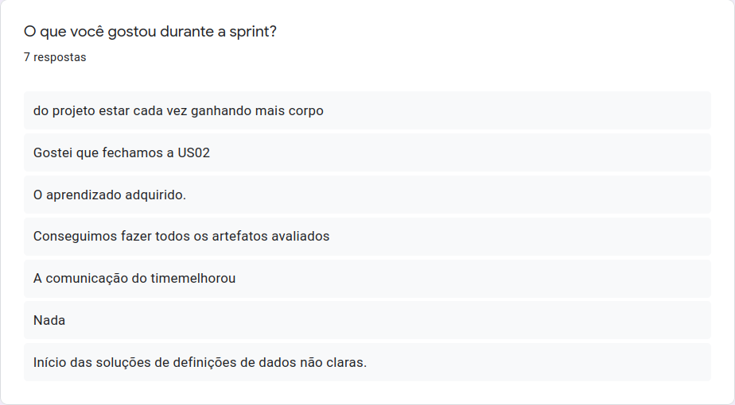
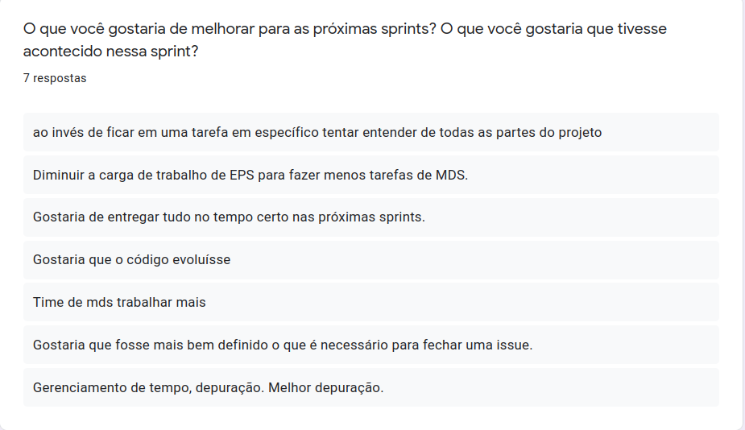
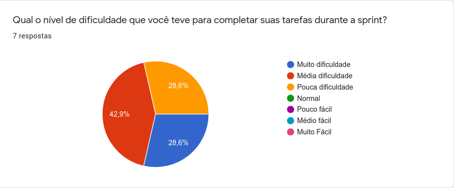
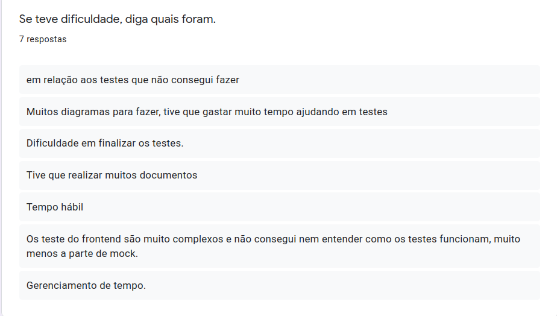
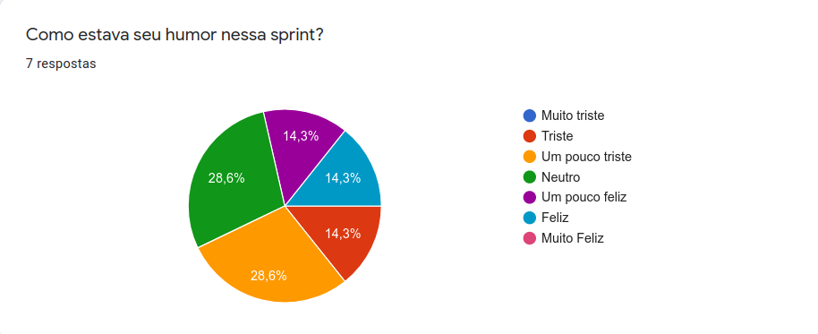

<h1 style="text-align: center">Sprint Restrospective</h1>

## Histórico de Revisão
| Data | Versão | Descrição | Autor(es)|
|:----:|:------:|:---------:|:--------:|
| 18/09/21 | 1.0 | Adiciona a retrospectiva | [Ivan Diniz Dobbin](https://github.com/darmsDD)|

## Análise do Scrum Master

A equipe em sua maioria parecia estar com humor perto do neutro e acredita-se que um contribuidor tenha sido a completude de quase todas as issues. Houve algumas dificuldades em relação aos testes e uma reclamação de sobrecarga por parte da equipe de EPS, que teve que realizar suas funções e participar da codificação ao mesmo tempo. 

No [gráfico de dificuldade](#dificuldades) é possível observar que esta sprint foi especialmente difícil, isso aconteceu pois a release 1 estava muito próxima.
Houve satisfação por completar quase todas as issues e apesar da melhora na comunicação ser mencionada, ainda existem problemas que precisam ser solucionados.
Os problemas dos testes e sobrecarga da equipe devem ser reduzidos ao longo das sprints, com o aumento do conhecimento técnico e redução da dependência da equipe de MDS com EPS.

## Pontos Levantados

## Dificuldades

## Humor

