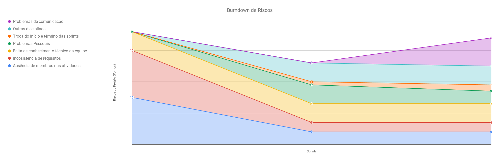
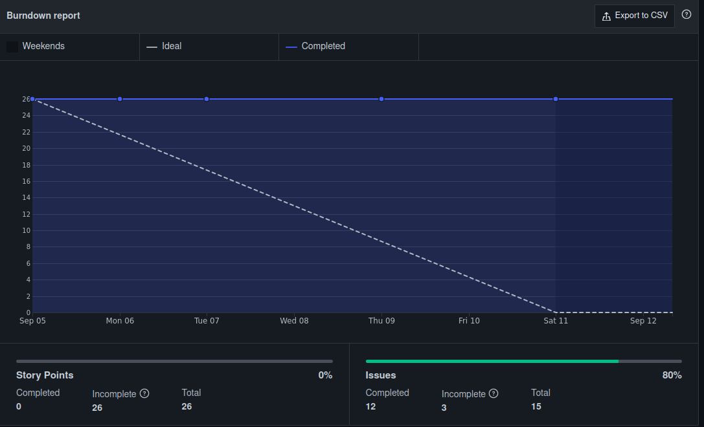
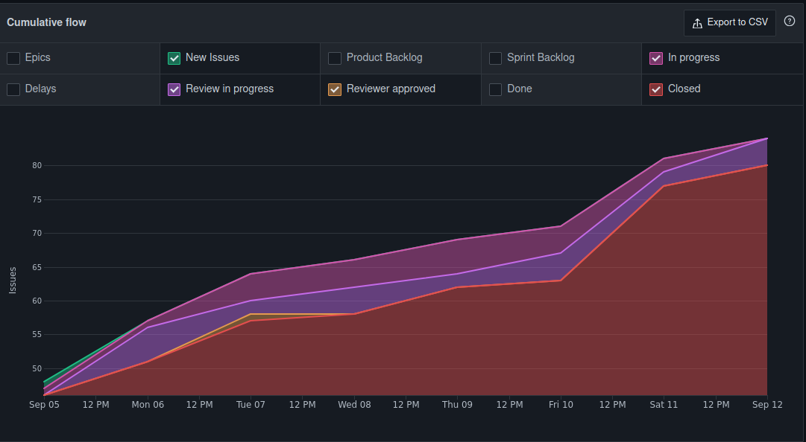
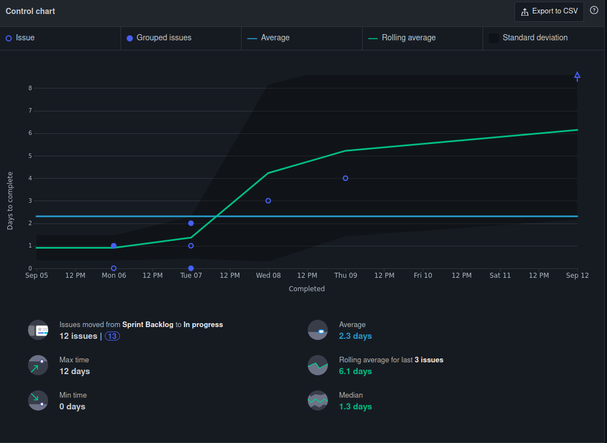
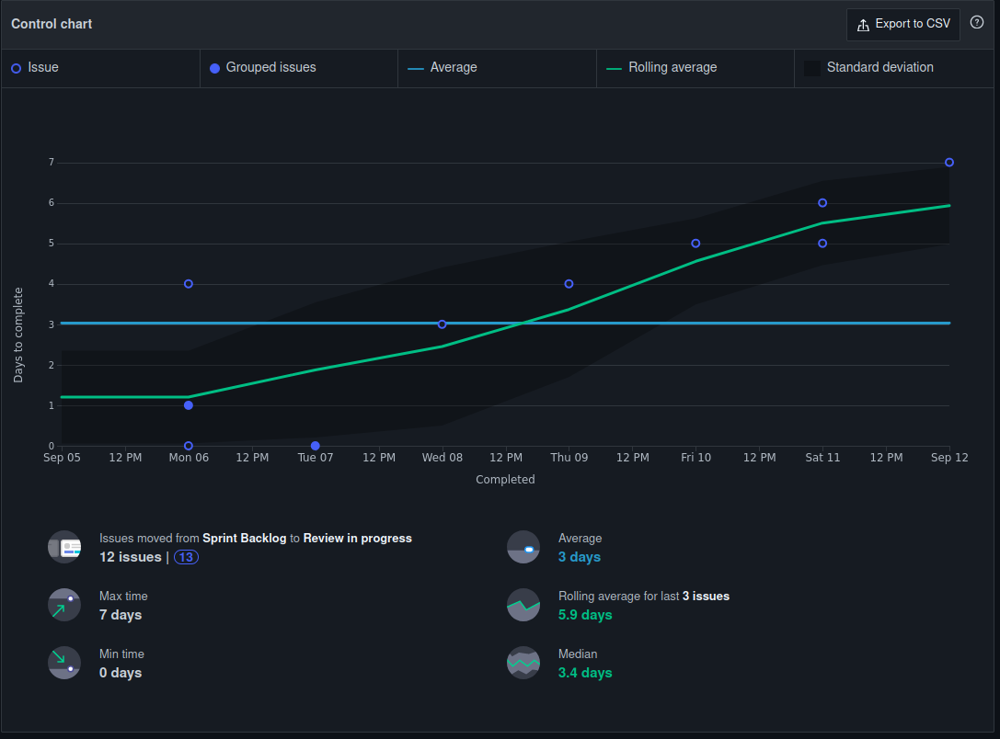
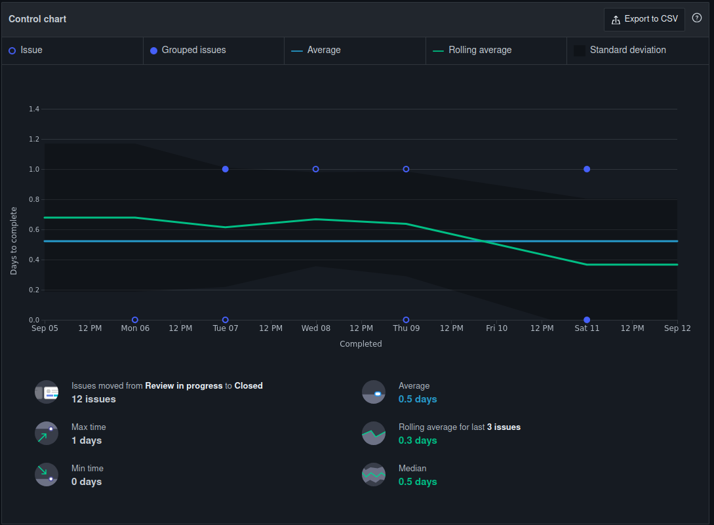
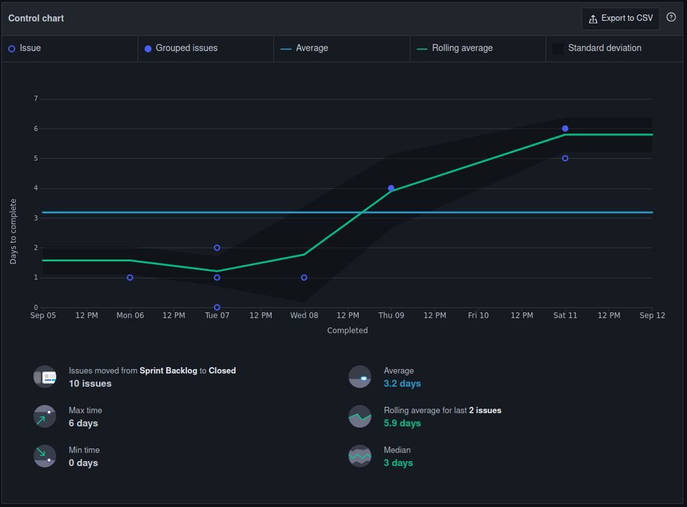
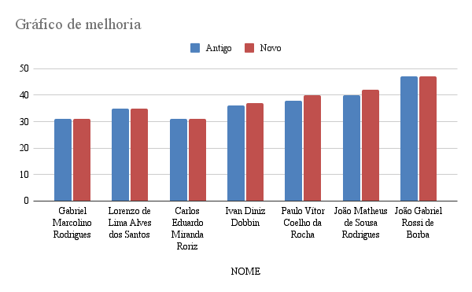

<h1 style="text-align: center">Sprint Review</h1>

## Histórico de Revisão
| Data | Versão | Descrição | Autor(es)|
|:----:|:------:|:---------:|:--------:|
| 18/09/21 | 1.0 | Adiciona o Review | [Ivan Diniz Dobbin](https://github.com/darmsDD) |

## Quando
Essa sprint se iniciou no dia 05/09/2021 e durou 7 dias terminando dia 12/09/2021 

## Análise do Scrum Master

É possível perceber pelas issues que foram completadas que a equipe de EPS está conseguindo realizar suas issues, porém a equipe de MDS não está. Visto este problema a equipe de EPS decidiu separar um tempo maior para parear com a equipe de MDS.  Os resultados dessa atitude devem ser revelados na próxima sprint.
Espera-se que a dependência de MDS com EPS diminua ao longo das sprints. 

A equipe após acompanhar o desenvolvimento das histórias de usuário decidiu que o membros de EPS deveriam também codificar mesmo sem a presença de membros de MDS. Então na sprint 4 pelo menos 1 história de usuário deve se tornar de total ou quase total responsabilidade da equipe de EPS.

Observe que ainda não foram concluídos pontos pelo [burndown](#burndown), assim o velocity ainda não existe. A equipe tem concluído com um bom fluxo suas issues, iniciando e terminando-as ao longo da sprint. O resultado dessa atitude é representado no [cumulativeFlow](#cumulative-flow), no qual é possível observar um desenvolvimento gradual.

Nos gráficos de ciclos foi encontrado apenas uma anormalidade, a [US1](https://github.com/fga-eps-mds/2021.1-PC-GO1/issues/39) que
teve uma variação muito maior que o esperado, sendo iniciada no último dia de sprint. As outras issues tiveram variações em sua movimentação ao longo do kanban, algumas issues demoram mais para serem concluídas, porém essa variação está dentro do esperado.

A equipe alterou o gráfico de conhecimentos durante essa sprint. Foi discutido que para mostrar um melhor desenvolvimento da equipe de EPS era necessário adicionar os papéis Scrum Master, Devops, Product Owner e Arquiteto no quadro de conhecimentos. 

É importante mostrar no [gráfico de riscos](#grafico-riscos) que surgiu um problema de comunicação nessa sprint. Os membros de MDS relataram em diversos momentos que houve falha de comunicação entre eles, um não sabia o que o outro estava fazendo. A equipe de EPS instruiu que os membros de MDS deveriam ser claros ao dizer qual atividade estavam realizando para evitar problemas maiores no futuro.

## Riscos

## Burndown

## Velocity
Como não foram completados pontos até o momento não há velocity.

## Cumulative Flow

## Control Charts

### Ciclo de uma issue sair de sprint backlog até in progress

### Ciclo de uma issue sair de sprint backlog até review in progress

### Ciclo de uma issue sair de review in progress até closed

### Ciclo de uma issue sair de sprint backlog até closed

## Conhecimento dos Membros

