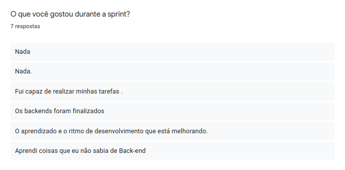
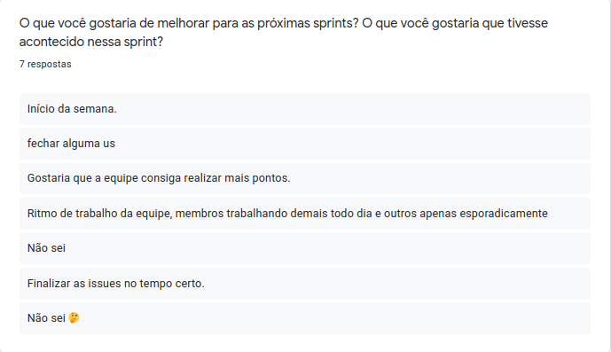
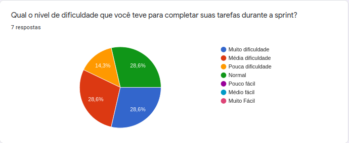
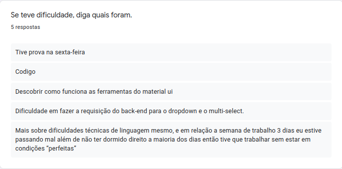
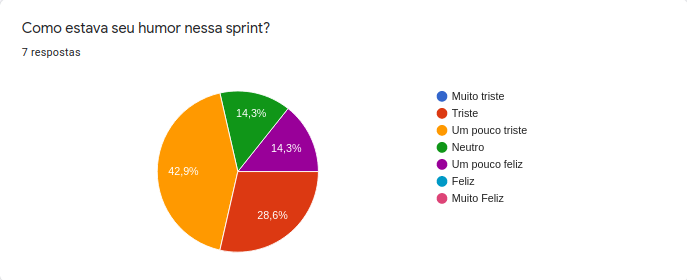

<h1 style="text-align: center">Sprint Restrospective</h1>

## Histórico de Revisão
| Data | Versão | Descrição | Autor(es)|
|:----:|:------:|:---------:|:--------:|
| 20/09/21 | 1.0 | Adiciona a retrospectiva | [Ivan Diniz Dobbin](https://github.com/darmsDD)|

## Análise do Scrum Master

É possível perceber observando os [pontos levantados](#pontos-levantados) que a equipe está cada vez mais satisfeita com seu desempenho, porém ainda estamos longe do ideal, ainda há muitas reclamações da entrega de poucos pontos por sprint.

Um lado positivo da sprint foi que os membros conseguiram realizar suas atividades com menos dificuldade em relação a sprint anterior, observe em [dificuldades](#dificuldades). Perceba também que foi uma semana conturbada com diversas dificuldades diferentes, alguns membros tinham prova, outros tiveram problemas pessoais e tivemos até problemas técnicos.

Infelizmente o grupo não estava com um bom humor nessa sprint, observe o [humor](#humor). Acreditamos que essa é uma das razões pela não completude de todas as tarefas. Será investigado o que afetou o humor dos membros, e se possível criaremos planos para evitar que isso se repita.

## Pontos Levantados

## Dificuldades

## Humor

