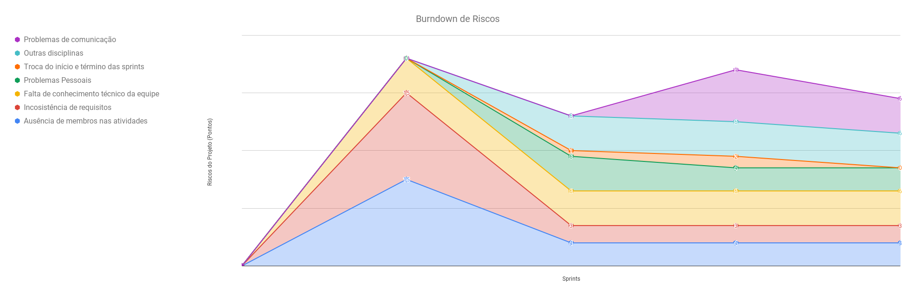
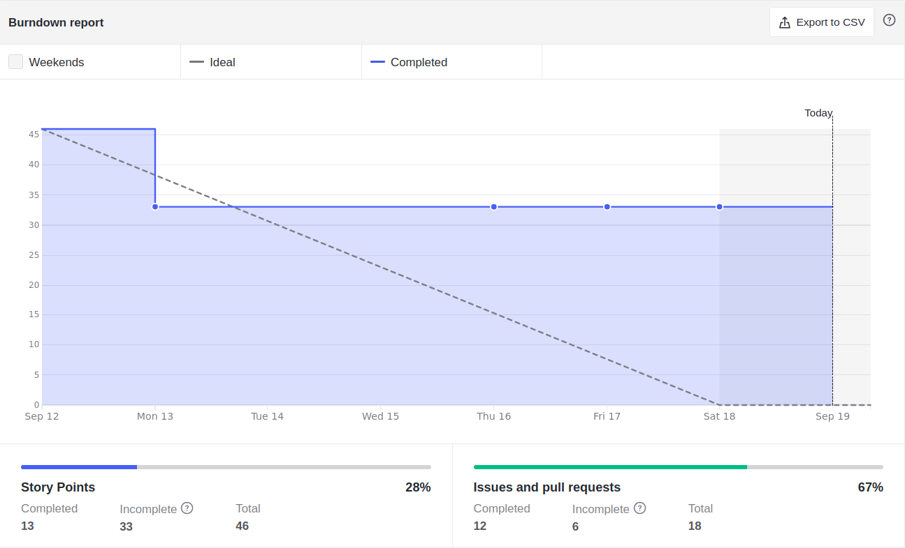
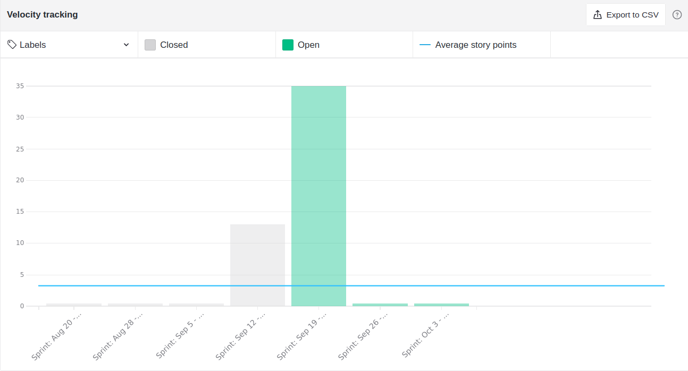
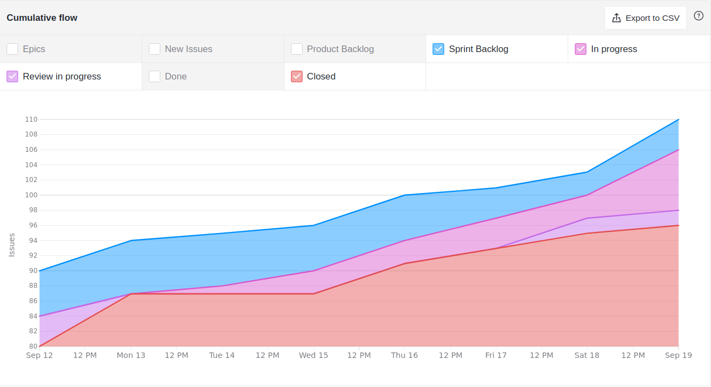
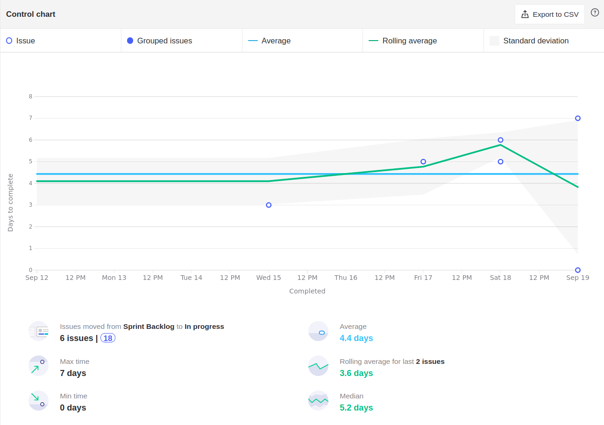
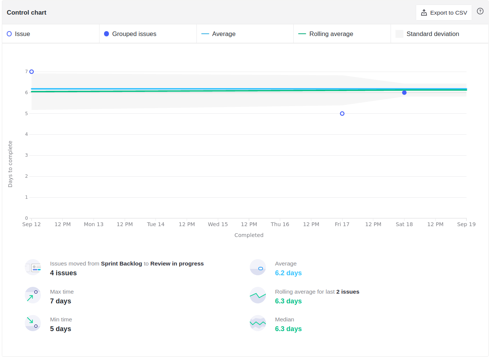
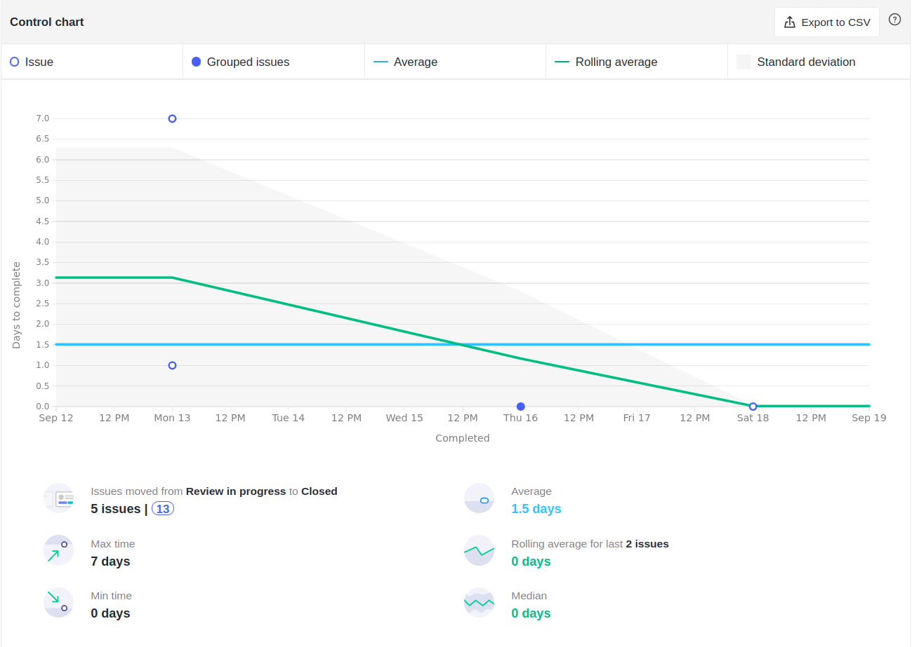
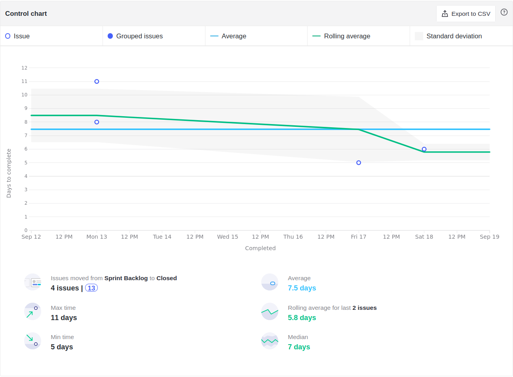
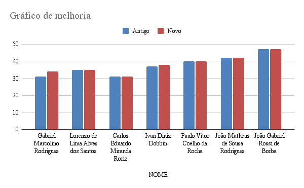

<h1 style="text-align: center">Sprint Review</h1>

## Histórico de Revisão
| Data | Versão | Descrição | Autor(es)|
|:----:|:------:|:---------:|:--------:|
| 19/09/21 | 1.0 | Adiciona o Review | [Ivan Diniz Dobbin](https://github.com/darmsDD) |

## Quando
Essa sprint se iniciou no dia 12/09/2021 e durou 7 dias terminando dia 19/09/2021 

## Análise do Scrum Master

É possível observar pelo [burndown](#burndown) que a equipe conseguiu completar uma história de usuário
pela primeira vez. A equipe percebendo os atrasos decidiu focar mais na parte de codificação. Nessa sprint apesar de apenas 1 história ter sido concluída, outras estão perto de serem finalizadas. Esse fato se demonstra no velocity no qual a equipe acredita que irá concluir mais de 30 pontos.

Analisando os gráficos de [cumulativeFlow](#cumulative-flow) e os gráficos de ciclo é possível observar alguns fatores:

- Demora para iniciar issues, muitas demorando em média mais de 4 dias.
- Houve uma constante no tempo de ir para revisão, com a maioria tendo uma média de 6 dias, porém ao analisar o item anterior percebemos que algumas issues poderiam ter ido para a revisão em menos dias.
- Percebe-se uma anomalia no qual uma issue ficou 7 dias em revisão, isso ocorreu pois foram encontrados diversos erros e foi necessário 1 sprint toda para resolver.
- Demora na conclusão das issues, com a média sendo de 7.5 dias. Essa média é maior que o tempo da sprint que é de 7 dias.

Ao observar o gráfico de melhorias é possível ver a melhora da equipe de EPS mais claramente agora que os papéis entraram no quadro de conhecimentos. É possível observar também pelo gráfico de riscos que alguns riscos diminuiram o seu nível, significando que o plano de mitigação está começando a demonstrar resultados.

## Riscos

## Burndown

## Velocity

## Cumulative Flow

## Control Charts

### Ciclo de uma issue sair de sprint backlog até in progress

### Ciclo de uma issue sair de sprint backlog até review in progress

### Ciclo de uma issue sair de review in progress até closed

### Clico de uma issue sair de sprint backlog até closed

## Conhecimento dos Membros

