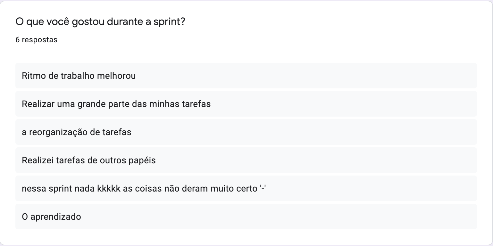
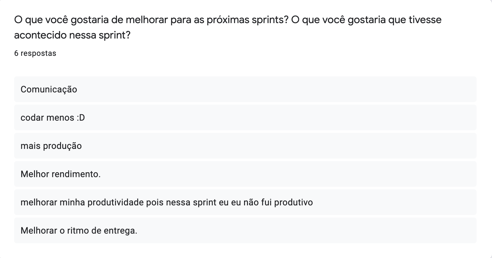
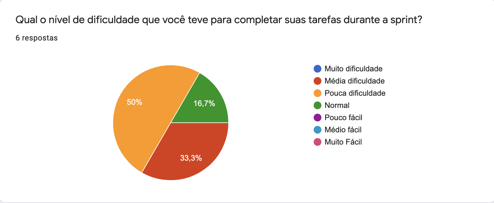
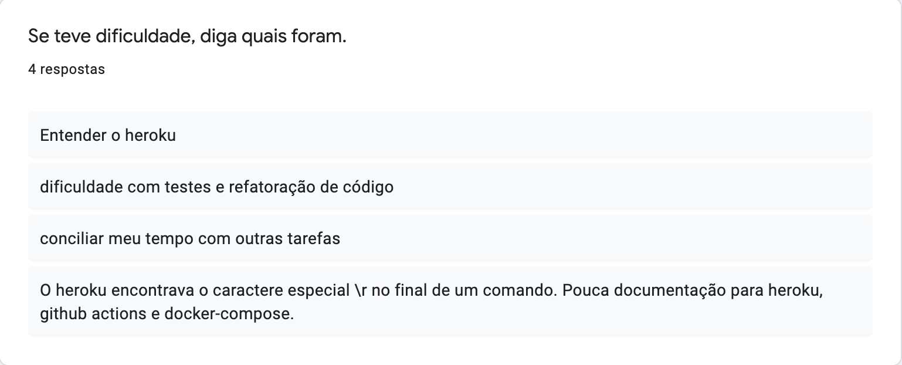
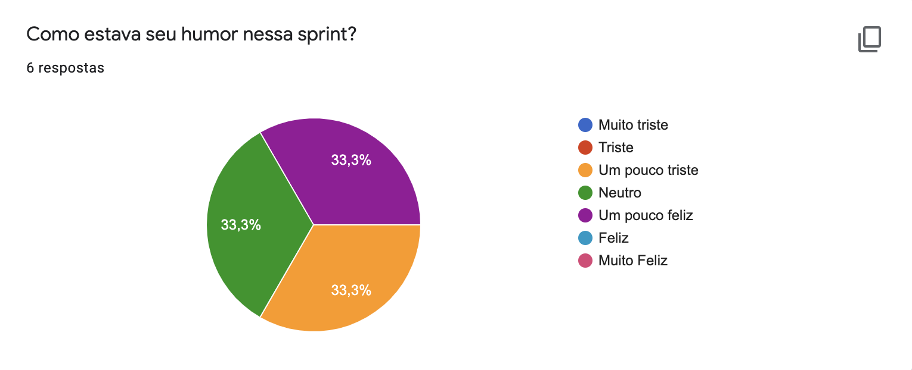

<h1 style="text-align: center">Sprint Restrospective</h1>

## Histórico de Revisão
| Data | Versão | Descrição | Autor(es)|
|:----:|:------:|:---------:|:--------:|
| 02/10/21 | 1.0 | Adiciona a retrospectiva | [Paulo Vítor](https://github.com/PauloVitorRocha)|

## Análise do Scrum Master

É possível perceber observando os [pontos levantados](#pontos-levantados) que a equipe achou pertinente a distribuição das tarefas para cada membro e isso permitiu um maior aprendizado e uma melhora no ritmo de trabalho apesar de não termos conseguido entregar nenhum ponto.

Um ponto a ser melhorado que foi levantado por quase todos os membros foi querer melhorar o ritmo das entregas para as próximas sprints.

Um lado positivo da sprint foi que os membros conseguiram realizar suas atividades com menos dificuldade em relação a sprint anterior já que nessa sprint não houve nenhum membro com muita dificuldade, observe em [dificuldades](#dificuldades).
Com relação as dificuldades temos:

- Dificuldades com heroku
- Dificuldade com testes
- Dificuldade em conciliar o tempo com outras tarefas

Outro lado positivo da sprint foi a melhora significativa de humor com relação a sprint passada, observe o [humor](#humor).

## Pontos Levantados

## Dificuldades

## Humor

