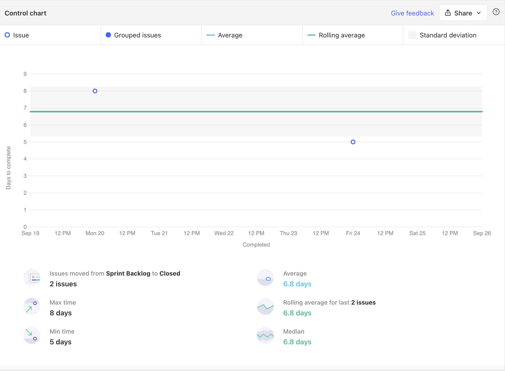

<h1 style="text-align: center">Sprint Review</h1>

## Histórico de Revisão
| Data | Versão | Descrição | Autor(es)|
|:----:|:------:|:---------:|:--------:|
| 02/10/21 | 1.0 | Adiciona o Review | [Paulo Vitor](https://github.com/PauloVitorRocha) |

## Quando
Essa sprint se iniciou no dia 19/09/2021 e durou 7 dias terminando dia 26/09/2021

## Análise do Scrum Master

Nessa sprint apesar de nenhuma história ter sido concluída, muitas estão perto de serem finalizadas. Esse fato se demonstra no velocity no qual a equipe acredita que irá concluir mais de 50 pontos.

Algumas issues como por exemplo as US's de Login não foram fechadas pois são issues dependentes das US's anteriores que não conseguiram ser fechadas.

Nessa sprint foi introduzido um novo [risco](#risco) que é o retrabalho dos membros devido a entregas não coerentes com o padrão de qualidade necessário, tanto para a disciplina quanto para as necessidades do cliente.

Analisando os gráficos de [cumulativeFlow](#cumulative-flow) e os gráficos de ciclo é possível observar alguns fatores:

- Issues foram iniciadas mais rapidamente porém não houve tempo hábil para finaliza-las.
- Houve uma constante no tempo de ir para revisão, com a maioria tendo uma média de 5 dias.
- Houve uma média de tempo de 3 dias para revisão das issues.
- Demora na conclusão das issues, com a média sendo de 6.8 dias. Essa média é do tamanho da sprint praticamente que é de 7 dias.

Ao observar o gráfico de melhorias é possível ver a melhora da equipe de EPS mais claramente agora que os papéis entraram no quadro de conhecimentos. É possível observar também pelo gráfico de riscos que alguns riscos diminuiram o seu nível, significando que o plano de mitigação está começando a demonstrar resultados.

## Riscos

## Burndown

## Velocity

## Cumulative Flow

## Control Charts

### Ciclo de uma issue sair de sprint backlog até in progress

### Ciclo de uma issue sair de sprint backlog até review in progress

### Clico de uma issue sair de sprint backlog até closed

### Ciclo de uma issue sair de review in progress até closed

## Conhecimento dos Membros

