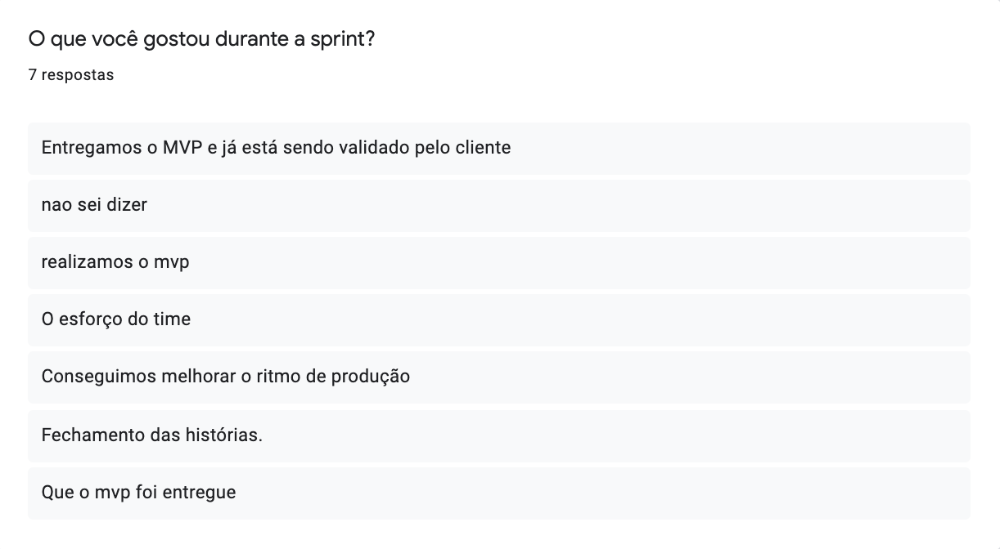
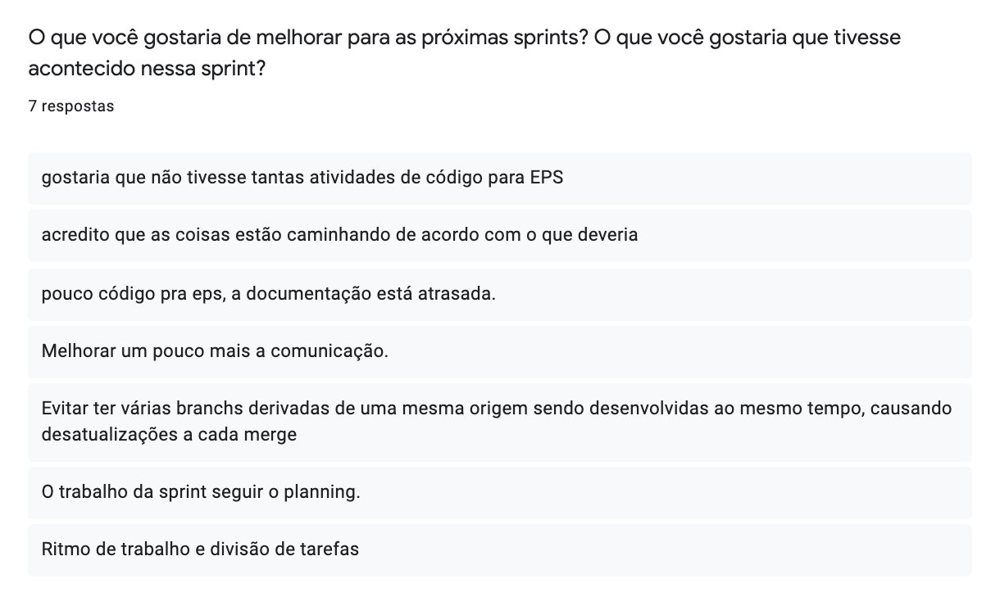
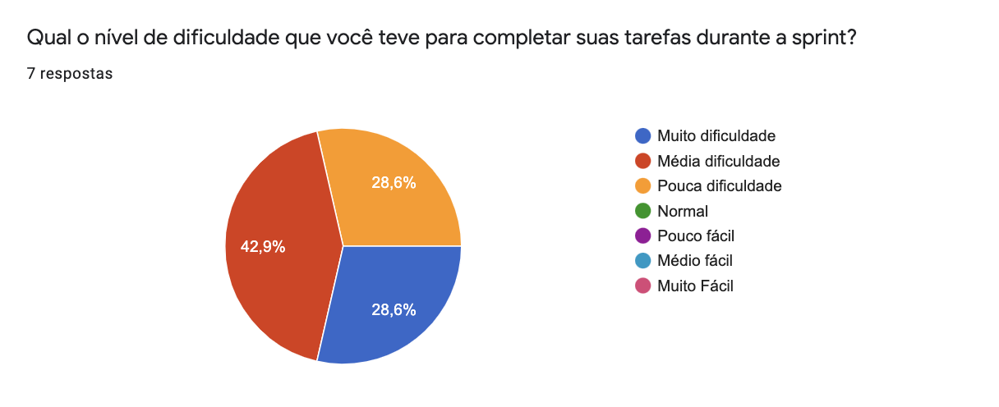
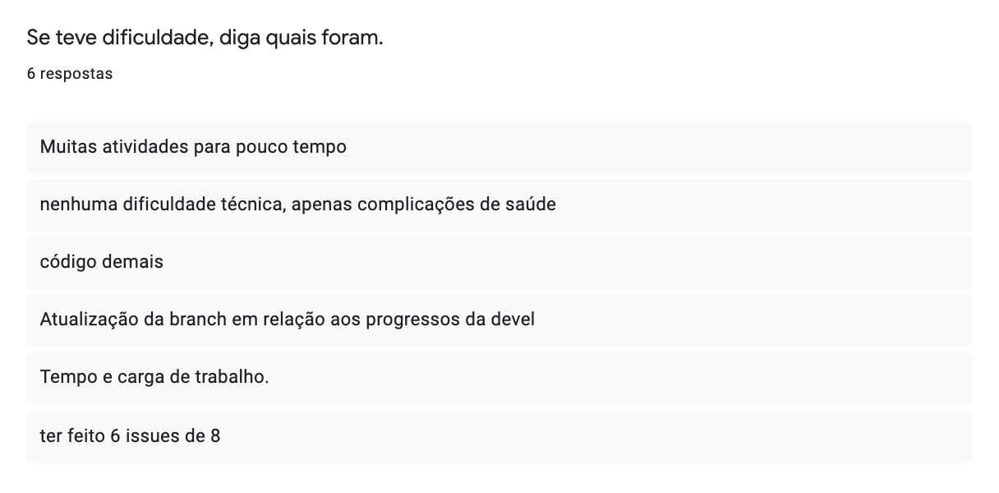
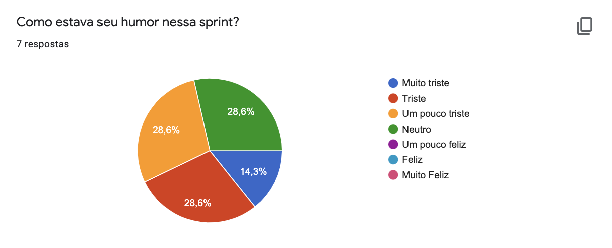

<h1 style="text-align: center">Sprint Restrospective</h1>

## Histórico de Revisão
| Data | Versão | Descrição | Autor(es)|
|:----:|:------:|:---------:|:--------:|
| 08/10/21 | 1.0 | Adiciona a retrospectiva | [Paulo Vítor](https://github.com/PauloVitorRocha)|

## Análise do Scrum Master

É possível perceber observando os [pontos levantados](#pontos-levantados) que a equipe ficou bastante feliz com a entrega do MVP para validação do cliente.

Um ponto a ser melhorado que foi levantado por quase todos os membros de EPS foi querer diminuir a quantidade de atividades relacionadas a código para as próximas sprints e também melhorar a comunicação.

Um lado positivo da sprint foi a entrega do MVP onde os membros conseguiram realizar todas as atividades que estavam atrasadas e realizar essa entrega.

Um ponto negativo foi que a dificuldade para realizar todas essas tarefas aumentou significativamente  onde nenhum membro teve menos do que pouca dificuldade, observe em [dificuldades](#dificuldades).
Com relação as dificuldades temos:

- Excesso de atividades
- Conciliar o tempo
- Manter a sua branch atualizada com as inúmeras entregas

Outro ponto negativo da sprint foi a piora significativa de humor com relação a sprint passada onde 5 dos 7 membros estavam tristes. Observe o [humor](#humor).

## Pontos Levantados

## Dificuldades

## Humor

