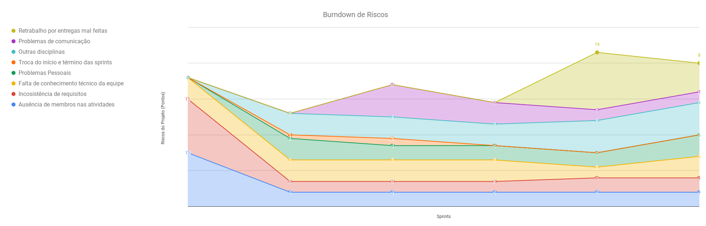
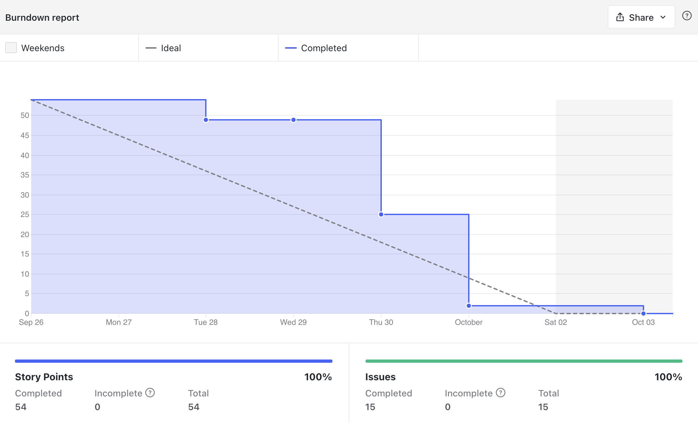
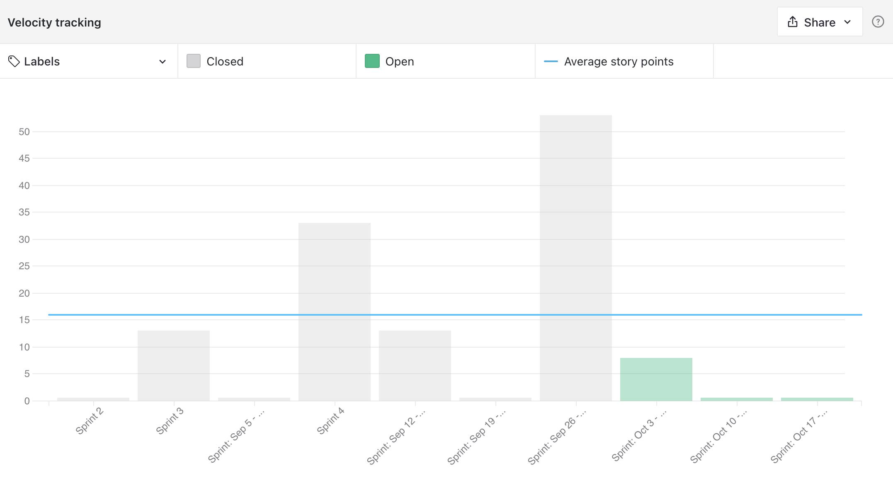
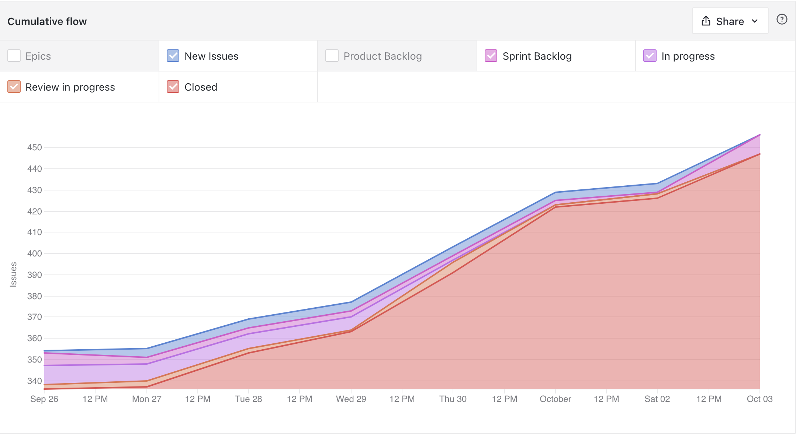
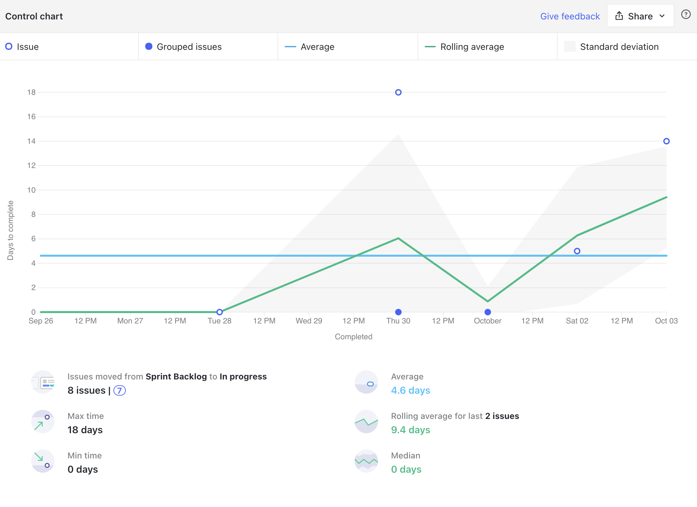
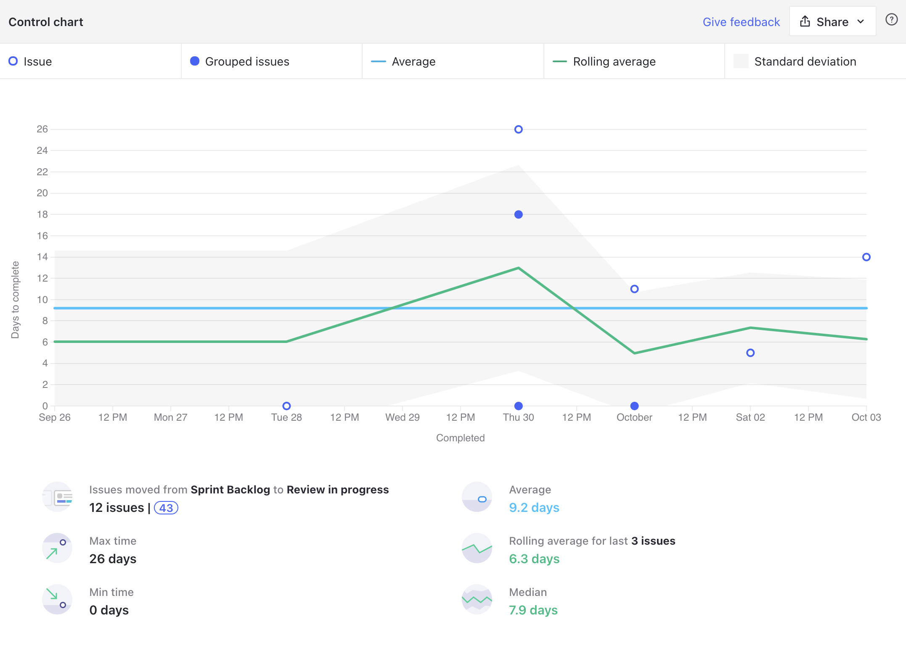
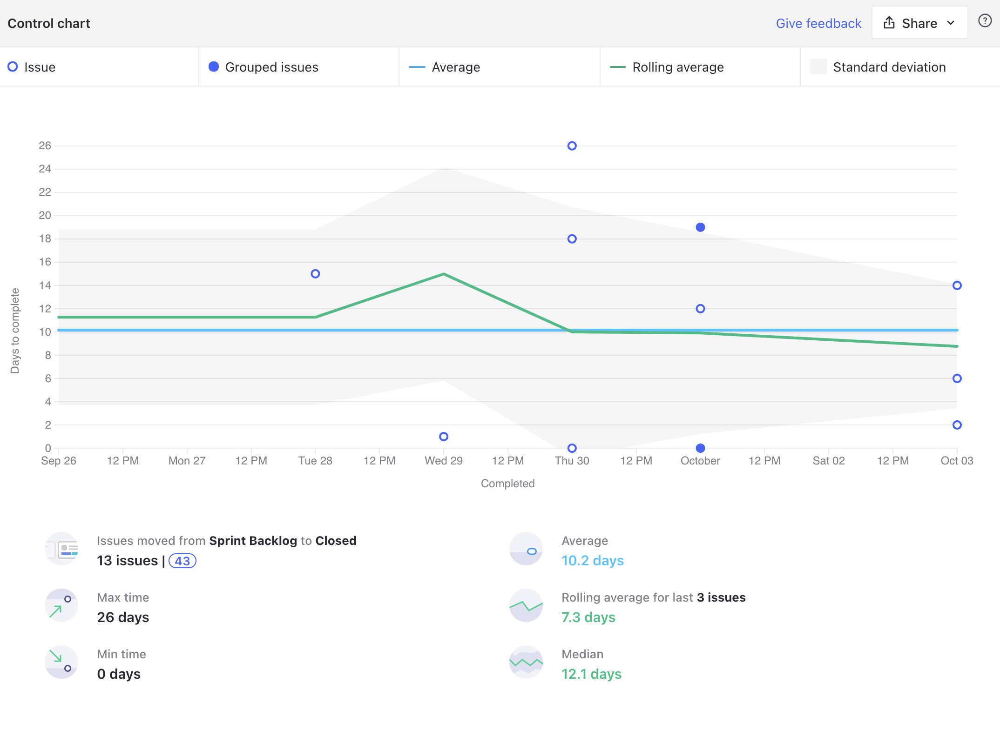
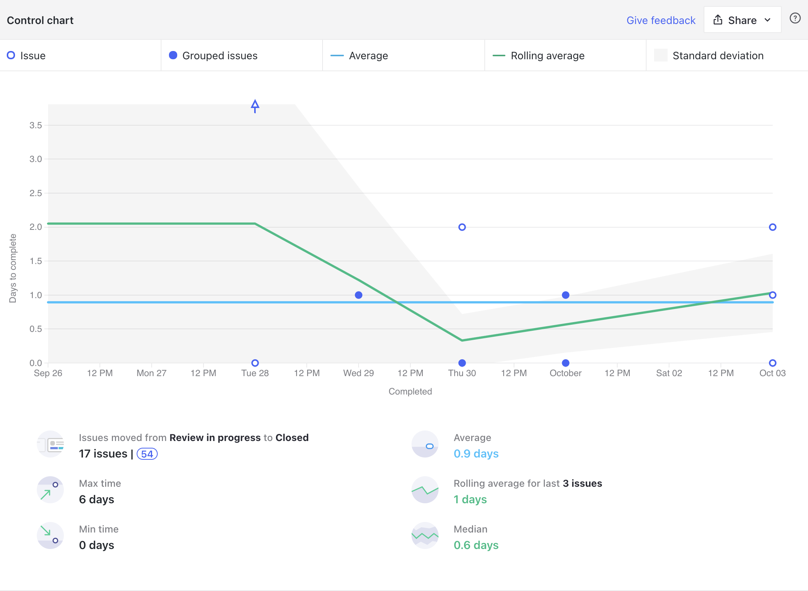
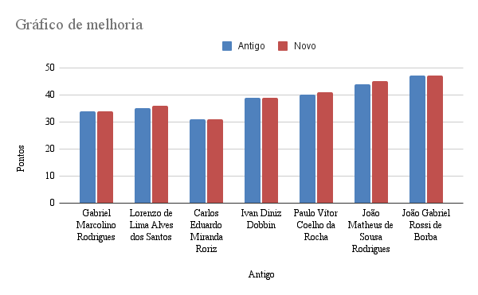

<h1 style="text-align: center">Sprint Review</h1>

## Histórico de Revisão
| Data | Versão | Descrição | Autor(es)|
|:----:|:------:|:---------:|:--------:|
| 08/10/21 | 1.0 | Adiciona o Review | [Paulo Vitor](https://github.com/PauloVitorRocha) |

## Quando
Essa sprint se iniciou no dia 26/09/2021 e durou 7 dias terminando dia 03/09/2021

## Análise do Scrum Master

Nessa sprint como previsto na sprint passada houve a entrega de 54 pontos o que não é nem de longe uma prática saudável a se fazer tendo em vista que a média de pontos entregues por sprint pela equipe é 16 pontos, porém devido a necessidade de entregar o MVP houve essa quantidade massiva de pontos entregues.

Nessa sprint o risco sobre entregas mal feitas introduzido na sprint anterior diminuiu sua probabilidade, porém seu impacto sempre vai ser muito alto no projeto observe em [riscos](#riscos).

Analisando os gráficos de [cumulativeFlow](#cumulative-flow) e os gráficos de ciclo é possível observar alguns fatores:

- Issues foram iniciadas mais rapidamente. A maioria no dia de início da sprint, porém duas issues que estavam no backlog demoraram muito para serem iniciadas porque era necessário completar outras issues para começa-las nos dando uma média de 4.6 dias de média para retirar uma issue do backlog e move-la para In Progress.
- Como haviam muitas issues atrasadas de outras sprints o tempo médio para sair do backlog e ir para revisão foi de 9.2 dias.
- Houve uma média de tempo de 0.9 dias para revisão das issues o que é um indicador positivo pois mostra que as revisões estavam ocorrendo bem rápido.
- Demora na conclusão das issues, com a média sendo de 10.2 dias. Essa média é maior do que o tamanho da sprint o que permite mais uma vez perceber que fechamos muitas issues atrasadas.

Podemos perceber que o time de MDS não está tendo melhorias significativas como esperado pela matéria.
Um motivo para isso estar ocorrendo pode ser por não estarem lembrando de preencher o quadro de conhecimentos, apesar de ser requisitado toda semana, e o outro motivo pode ser que não estão realmente conseguindo evoluir seus conhecimentos.

## Riscos

## Burndown

## Velocity

## Cumulative Flow

## Control Charts

### Ciclo de uma issue sair de sprint backlog até in progress

### Ciclo de uma issue sair de sprint backlog até review in progress

### Clico de uma issue sair de sprint backlog até closed

### Ciclo de uma issue sair de review in progress até closed

## Conhecimento dos Membros

