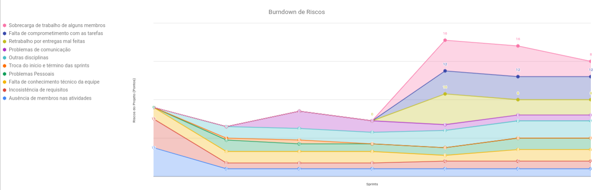
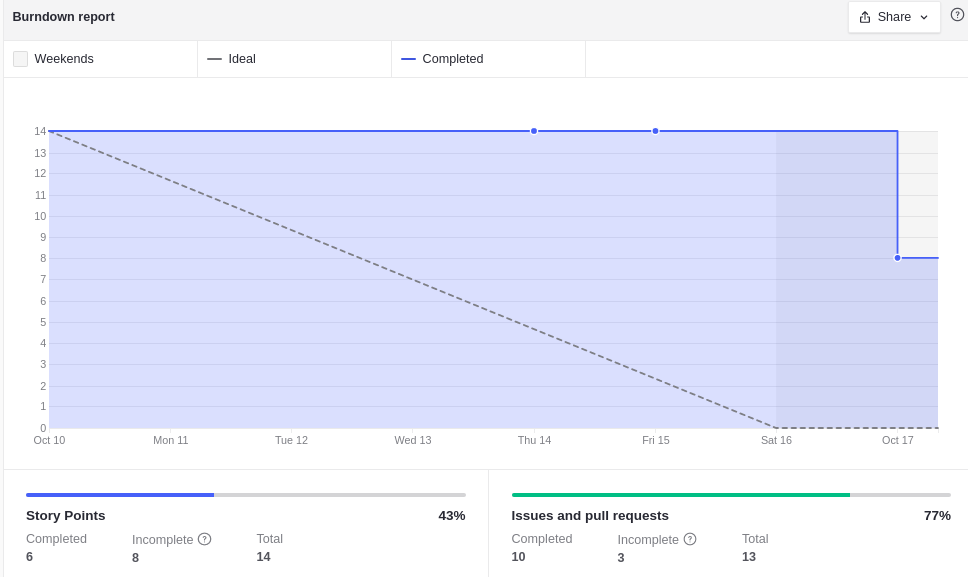
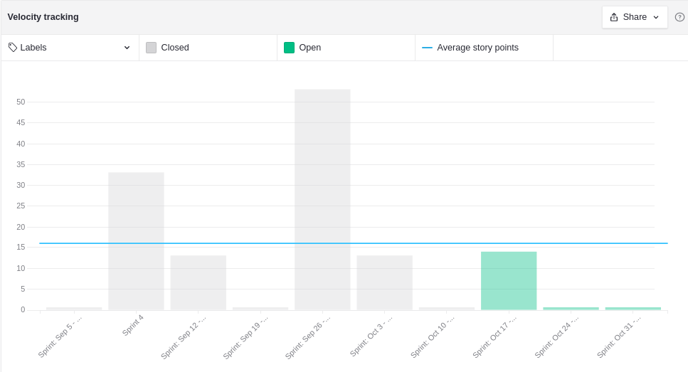
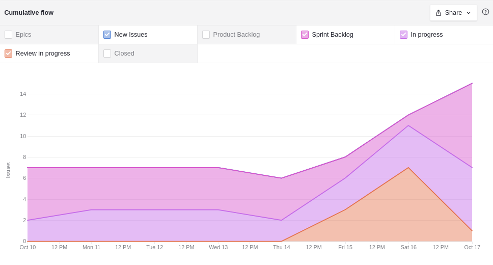
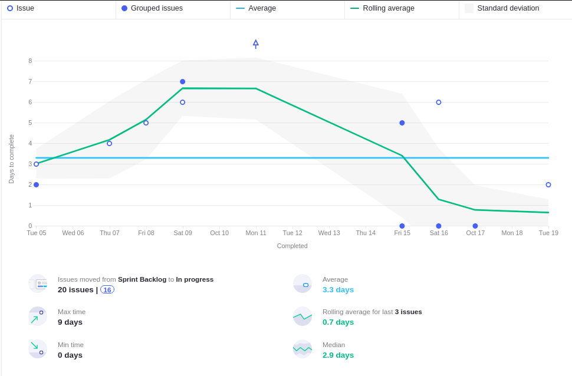
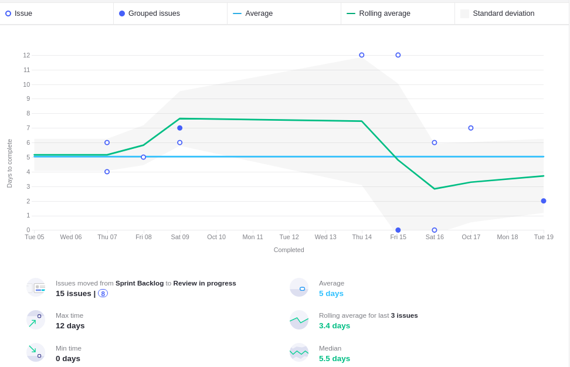
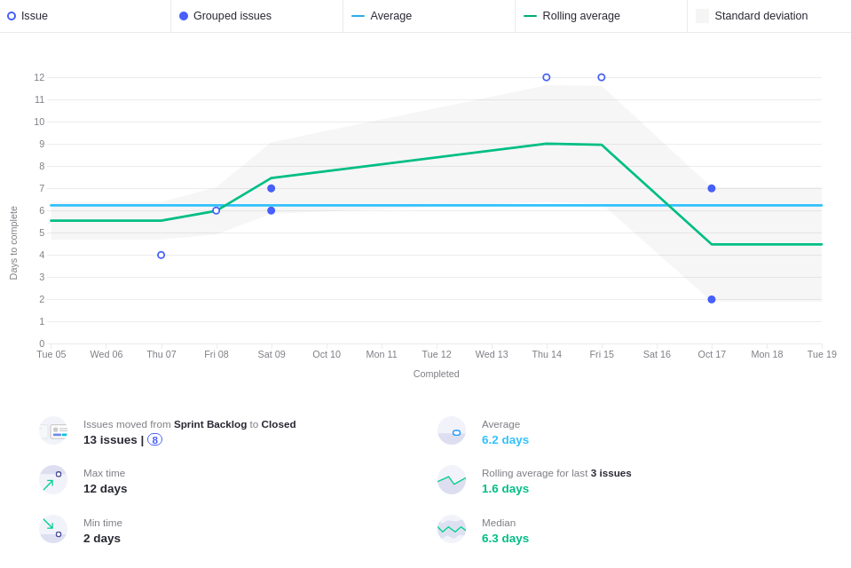
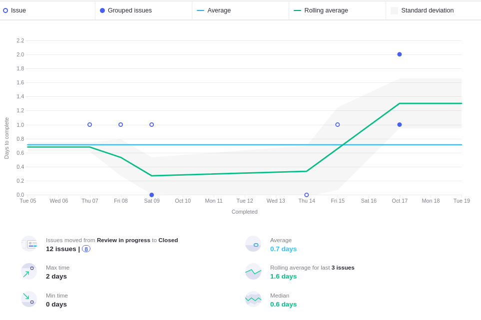
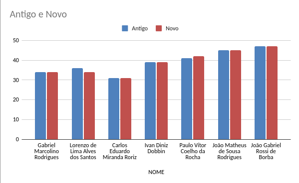

<h1 style="text-align: center">Sprint Review</h1>

## Histórico de Revisão
| Data | Versão | Descrição | Autor(es)|
|:----:|:------:|:---------:|:--------:|
| 19/10/21 | 1.0 | Adiciona o review | [João Rossi](https://github.com/bielrossi15)|

## Quando
Essa sprint se iniciou no dia 03/10/2021 e durou 7 dias terminando dia 10/10/2021

## Análise do Scrum Master

Nessa sprint como previsto na sprint passada houve o planejamento para a entrega de 13 pontos, mas foram entregues apenas 5, da issue realizada pelos membros de EPS.

Nessa sprint os riscos se manteram [riscos](#riscos).

Analisando os gráficos de [cumulativeFlow](#cumulative-flow) e os gráficos de ciclo é possível observar alguns fatores:

- As issues foram iniciadas rapidamente, tal qual a sprint passada.
- Por serem em sua maioria, issues de doc, a média de tempo para revisão diminuiu.
- Houve uma média de tempo de 0.7 dias para revisão das issues o que é um indicador positivo pois mostra que as revisões estavam ocorrendo mais rapidamente que a sprint passada.
- O tempo de conclusão das issues melhorou muito, saindo de 10.2 para 6.2 na média.

Podemos perceber que o time de MDS não está tendo melhorias significativas como esperado pela matéria.
Um motivo para isso estar ocorrendo pode ser por não estarem lembrando de preencher o quadro de conhecimentos, apesar de ser requisitado toda semana, e o outro motivo pode ser que não estão realmente conseguindo evoluir seus conhecimentos.

## Riscos

## Burndown

## Velocity

## Cumulative Flow

## Control Charts

### Ciclo de uma issue sair de sprint backlog até in progress

### Ciclo de uma issue sair de sprint backlog até review in progress

### Clico de uma issue sair de sprint backlog até closed

### Ciclo de uma issue sair de review in progress até closed

## Conhecimento dos Membros

