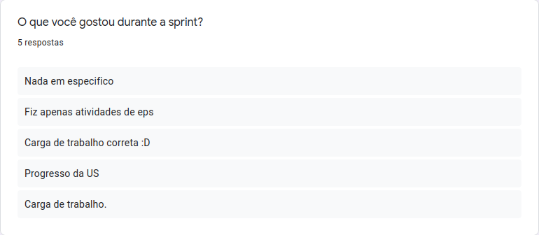
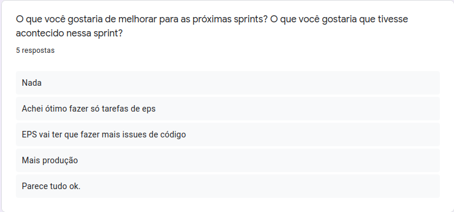
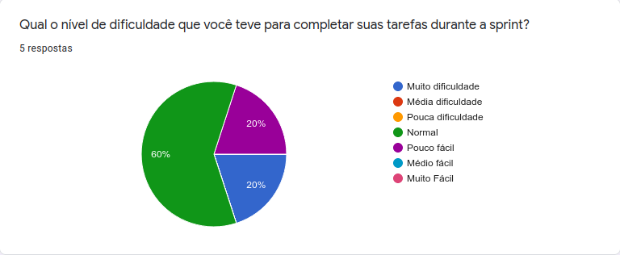
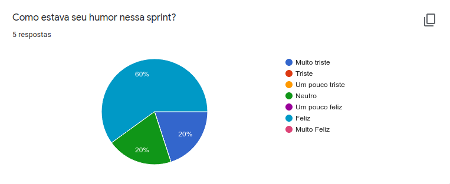

<h1 style="text-align: center">Sprint Restrospective</h1>

## Histórico de Revisão
| Data | Versão | Descrição | Autor(es)|
|:----:|:------:|:---------:|:--------:|
| 23/10/21 | 1.0 | Adiciona a retrospectiva |[Ivan Diniz Dobbin](https://github.com/darmsDD)|

## Análise do Scrum Master

Nessa sprint é percebido que a equipe de EPS gostou bastante da redistribuição da carga de trabalho e que a equipe no geral acreditou que a carga de trabalho estava mais balanceada. Uma consequência disso foi a redução na dificuldade das tarefas, observe o [gráfico de dificuldades](#grafico-dificuldades).

A equipe relatou em [melhorias](#melhorias) que EPS precisará realizar mais issues de código, e consequentemente isso aumentará a produção.

Como resultado dos itens anteriores a equipe teve uma melhora significativa no humor, com a maioria dos membros felizes, observe o [humor](#humor).

## Pontos Levantados

## Dificuldades

## Humor

