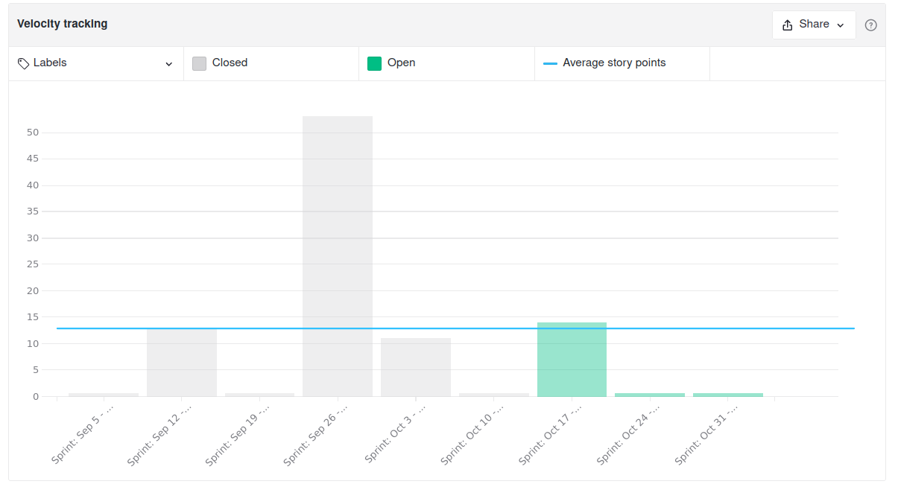
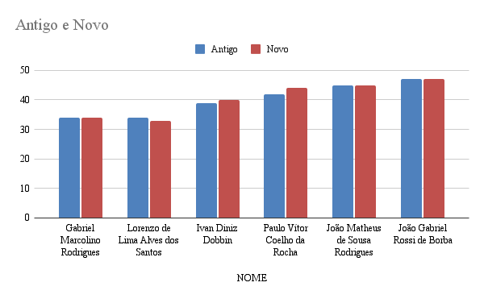

<h1 style="text-align: center">Sprint Review</h1>

## Histórico de Revisão
| Data | Versão | Descrição | Autor(es)|
|:----:|:------:|:---------:|:--------:|
| 23/10/21 | 1.0 | Adiciona o Review | [Ivan Diniz Dobbin](https://github.com/darmsDD) |

## Quando
Essa sprint se iniciou no dia 10/10/2021 e durou 7 dias terminando dia 16/10/2021

## Análise do Scrum Master

Nesta sprint houve uma redução da carga dos membros de eps, porém muitas issues não foram completas e nenhum ponto foi entregue. A maioria das issues que não foram entregues, foram concluídas no dia posterior 17/10/2021. O impacto deste atraso não foi notável, pois as issues atrasadas foram concluídas rapidamente, porém a única issue que MDS estava responsável não foi concluída e não estava perto de ser concluída. Pode-se observar um padrão de entregas atrasadas por parte da equipe de MDS e isso vem acontecendo pois apenas 1 membro trabalha muito, outro trabalha bem menos e o terceiro não trabalhava. 

O terceiro membro retirou a matéria pois havia algumas semanas que estava com desempenho nulo ou extremamente baixo. Assim foi adicionado um novo risco na planilha de [riscos](#riscos). A equipe já vinha sofrendo com a baixa de um membro desde o início do semestre e com a saída de mais 1 membro o impacto foi muito grande. Houve uma redução significativa de escopo.

Observe pelo burndown que apenas 1 issue pontuada foi entregue, porém esta ocorreu dia 17, fora do período da sprint. No velocity é possível observar uma velocidade média de 11 pontos, porém existem muitas irregulariades, com sprint de 53 pontos entregues e sprint de 0 pontos.

Após análise do [cumulative flow](#cumulative-flow), percebe-se que o fluxo de início foi como o padrão, porém a equipe teve dificuldade em finalizar suas issues.

Alguns pontos importantes para se observar dos [Control Charts](#control-charts):
    
- O início das issues se manteve padrão, com uma média de 3.3 dias
- O tempo para issues irem para o review seguiu o formato de queda em vez de escadinha, ou seja, muitas issues foram para a revisão no final da sprint. A média ainda se manteve em 5 dias.
- A grande distonância ocorreu em [sprint backlog até closed](#ciclo-de-uma-issue-sair-de-sprint-backlog-ate-closed), com a média saindo de 6 dias para 12.
- O lado positivo é que as issues que estavam em revisão foram rapidamente corrigidas, com média de menos de 1 dia.

Por último é importante ressaltar o quadro de conhecimento, onde alguns membros vem crescendo gradualmente e outros estão estagnados, o caso mais estranho é de um membro de MDS que vem perdendo conhecimentos nas últimas sprints. Isso será discutido no próximo planning.

## Riscos

## Burndown

## Velocity

## Cumulative Flow

## Control Charts

### Ciclo de uma issue sair de sprint backlog até in progress

### Ciclo de uma issue sair de sprint backlog até review in progress

### Ciclo de uma issue sair de sprint backlog até closed

### Ciclo de uma issue sair de review in progress até closed

## Conhecimento dos Membros

