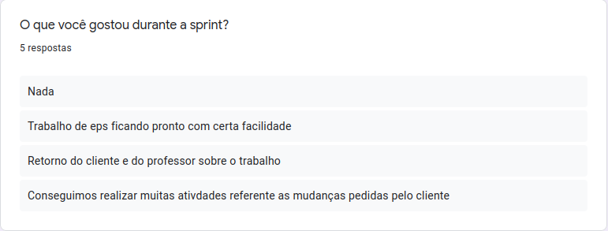
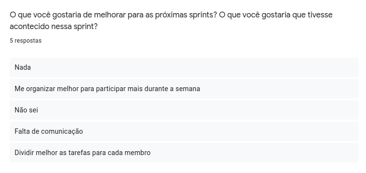
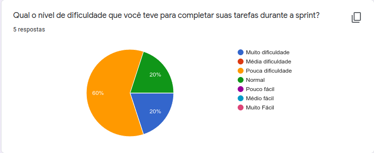
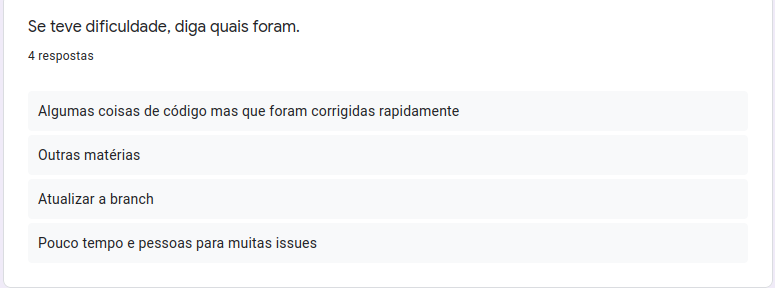
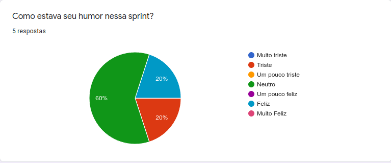

<h1 style="text-align: center">Sprint Restrospective</h1>

## Histórico de Revisão
| Data | Versão | Descrição | Autor(es)|
|:----:|:------:|:---------:|:--------:|
| 25/10/21 | 1.0 | Adiciona a retrospectiva |[Ivan Diniz Dobbin](https://github.com/darmsDD)|

## Análise do Scrum Master

Nessa sprint é a equipe gostou de receber o feedback do cliente e do professor, gostou também que conseguiu realizar as primeiras alterações que foram requisitadas. A dificuldade aumento nessa sprint, porém isto é normal visto o tempo curto antes de finalizar o semestre, observe o [gráfico de dificuldades](#grafico-dificuldades).

A equipe relatou em [melhorias](#melhorias) que é necessário uma melhor divisão das tarefas de EPS, pois muitas issues têm todos os membros marcados, mas os responśaveis são apenas 1 ou 2. Novamente problemas de comunicação ocorreram entre os membros de MDS, porém como dito no review, a equipe de EPS conversou novamente sbre este tópico, porém não acredita que trará algum efeito nesta etapa final.

O [humor](#humor) mostra que a maioria dos membros está aguentando bem esse fim de semestre.

## Pontos Levantados

## Dificuldades

## Humor

