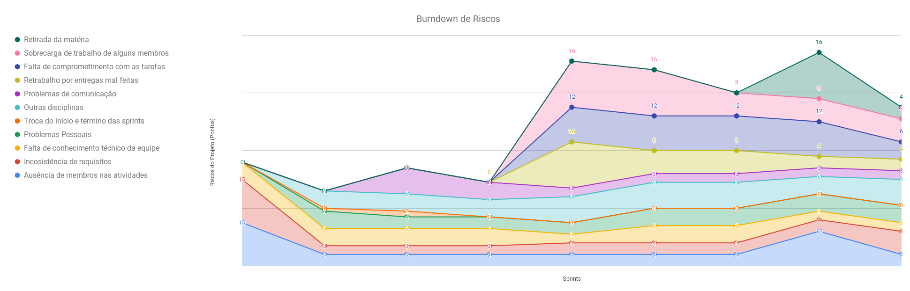
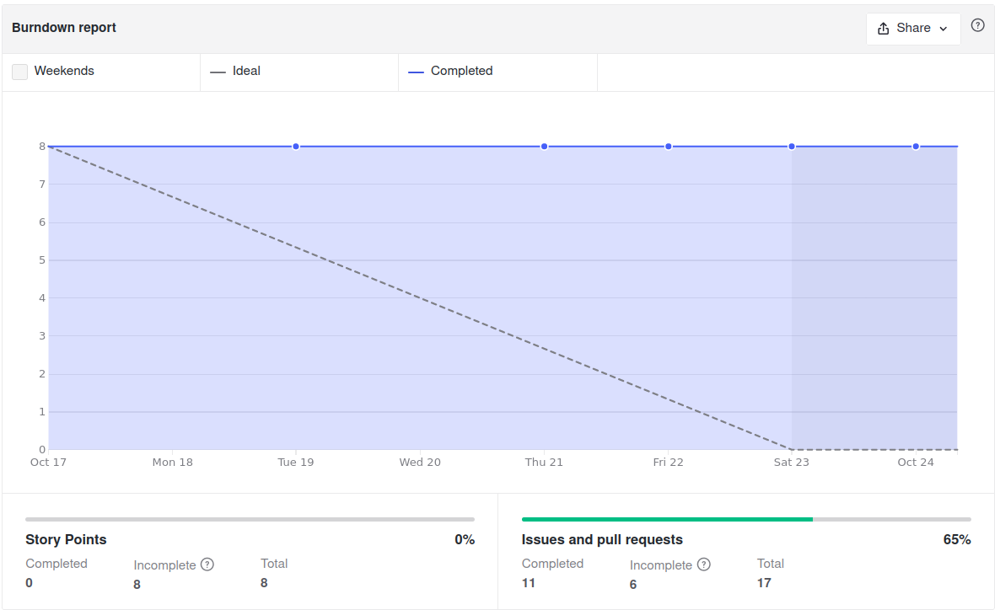
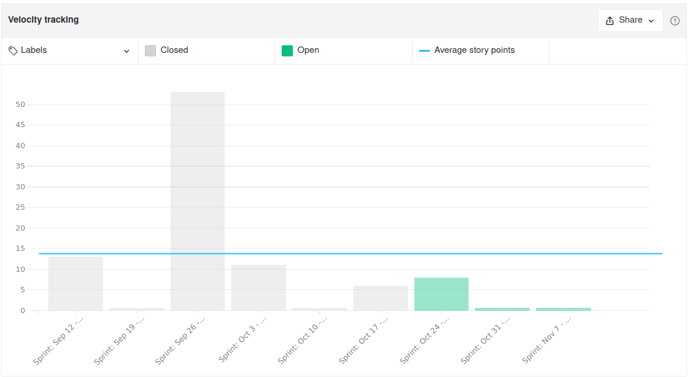
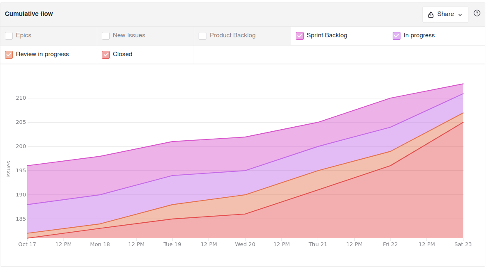
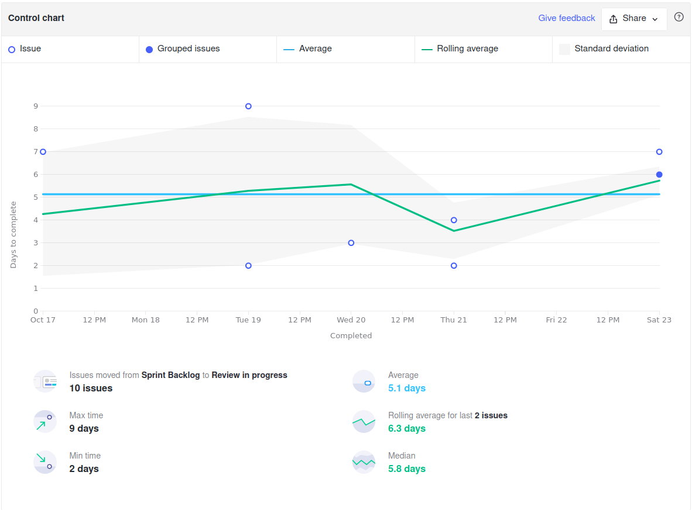
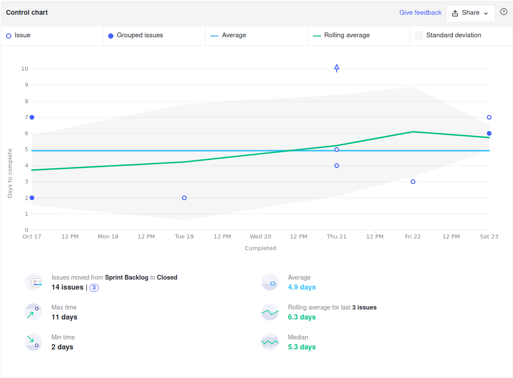
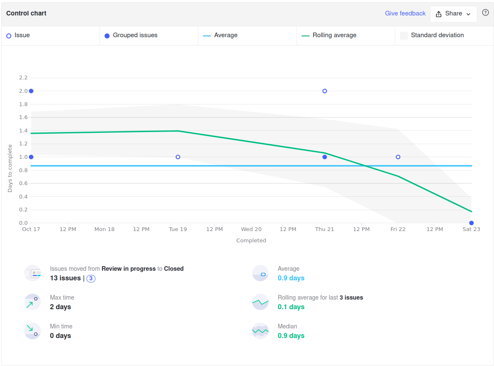
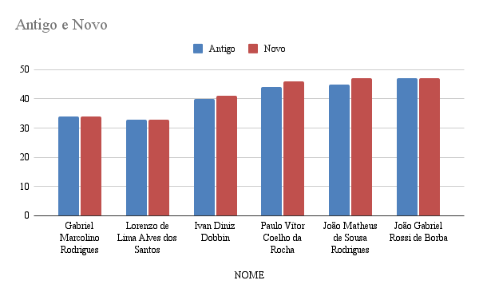

<h1 style="text-align: center">Sprint Review</h1>

## Histórico de Revisão
| Data | Versão | Descrição | Autor(es)|
|:----:|:------:|:---------:|:--------:|
| 25/10/21 | 1.0 | Adiciona o Review | [Ivan Diniz Dobbin](https://github.com/darmsDD) |

## Quando
Essa sprint se iniciou no dia 17/10/2021 e durou 7 dias terminando dia 24/10/2021

## Análise do Scrum Master

Nesta sprint a maioria das issues foram concluídas, com EPS terminando a maioria de suas issues. As issues que de hotfix não foram finalizadas pois o cliente lançou novos requisitos na reunião do dia 22/10/2021, fazendo com que essas issues tivessem alterações. Assim o time chegou ao consenso que essas issues deveriam ser realizadas na próxima sprint. A issue [Atualizar Analytics](https://github.com/fga-eps-mds/2021.1-pc-go1/issues/142) não foi finalizada pois o time decidiu que essa issue deveria se repetir até o final. 

As issues de MDS não foram finalizadas novamente. Houve bastante desenvolvimento na issue da US06: [Visualizar detalhes de um documento](https://github.com/fga-eps-mds/2021.1-pc-go1/issues/53), porém mesmo com 2 membros essa issue deveria estar finalizada. A outra issue de MDS [Atualizar histórias de usuário na wiki](https://github.com/fga-eps-mds/2021.1-pc-go1/issues/134) deveria ter sido facilmente completada durante a semana, pois era uma issue relativamente fácil, porém também não foi finalizada. Foi dito que a prioridade foi dada ao desenvolvimento da US06, porém nenhuma das 2 issues terminaram. A equipe de EPS conversou novamente com a equipe de MDS, porém como faltam apenas 2 sprints e essa conversa tem se repetido ao longo do semestre, dificilmente algo mudará até o final.

Observando o gráfico de [riscos](#riscos), é notado que os riscos **outras matérias** e **inconsistência de requisitos** cresceram nessa sprint. O risco  **outras matérias** cresceu, pois como faltam 2 semanas para o final do semestre a carga de trabalho de outras disciplinas cresce consideravelmente. O cliente tem pedido mudanças no sistema nas últimas semanas, porém o tempo é muito curto para atender os pedidos atuais e novos pedidos que possam surgir, assim o risco **inconsistência de requisitos** cresceu. O risco de **retirada de matéria** diminuiu consideravelmente pois nenhum membro discutiu com outros membros sobre esse tópico e faltam apenas 2 semanas.

A única história de usuário da sprint estava com MDS, e esta não foi finalizada, assim o [burndown](#burndown) mostra apenas uma linha reta. Estes atrasos prejudicam muito o escopo do trabalho, dos 8 épicos que a equipe planejou realizar inicialmente apenas 4 serão feitos.

Como não existiram pontos o [velocity](#velocity) fica cada dia mais distoante, sprints com 0 pontos e sprints com 53 pontos.

O [cumulative flow](#cumulative-flow) mostra que muitas issues foram concluídas no final da sprint em vez de durante, umas das possíveis razões para isso é o risco **outras matérias**. Assim os membros da equipe estão priorizando finalizar as tarefas de outras disciplinas que tem o prazo antes do fim da sprint.

Alguns pontos importantes para se observar dos [Control Charts](#control-charts):
    
- [1](#ciclo-de-uma-issue-sair-de-sprint-backlog-ate-in-progress): O tempo de início das issues reduziu de 3.3 para 2.9 dias, indicando que a equipe tem tentado iniciar as issues no começo da sprint. 
- [2](#ciclo-de-uma-issue-sair-de-sprint-backlog-ate-review-in-progress): Apesar da média ainda se manter em 5 dias, é possível perceber um processo mais gradual de issues indo para revisão.
- [3](#ciclo-de-uma-issue-sair-de-sprint-backlog-ate-closed): O tempo de conclusão reduziu consideravelmente, de 12 dias para 5.  
- [4](#ciclo-de-uma-issue-sair-de-review-in-progress-ate-closed): As issues continuam sendo corrigidas rapidamente, com média de menos de 1 dia. 
 
Por último é importante ressaltar o quadro de conhecimento, onde alguns membros vem crescendo gradualmente e outros estão estagnados. O decaimento de conhecimento de sprints passadas aconteceu pois o membro da equipe percebeu que não tinha tanto conhecimento como tinha acreditado anteriormente.

## Riscos

## Burndown

## Velocity

## Cumulative Flow

## Control Charts

### Ciclo de uma issue sair de sprint backlog até in progress

### Ciclo de uma issue sair de sprint backlog até review in progress

### Ciclo de uma issue sair de sprint backlog até closed

### Ciclo de uma issue sair de review in progress até closed

## Conhecimento dos Membros

